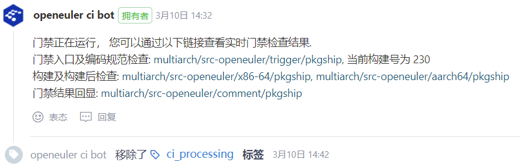
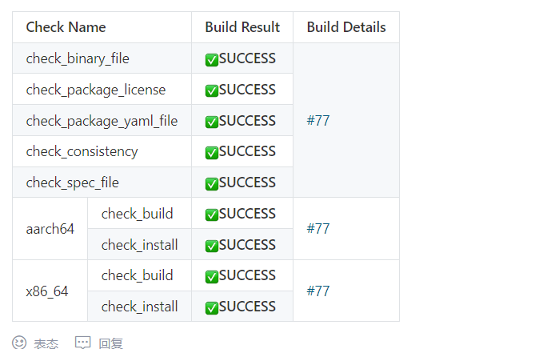
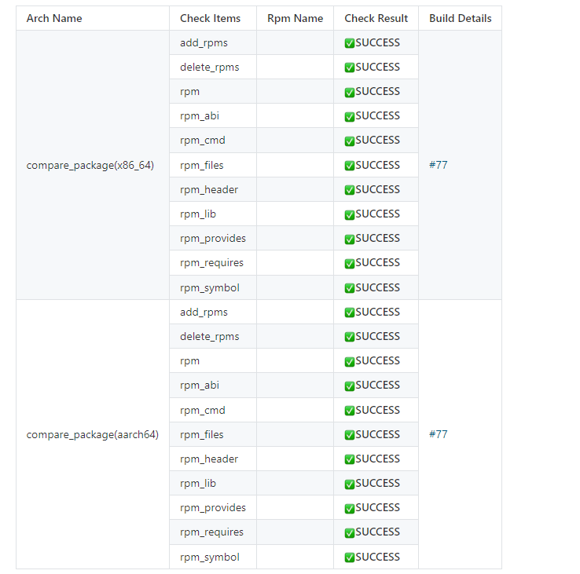
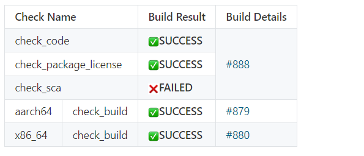

# 一、门禁功能介绍

## 1. 门禁功能

openEuler社区代码均托管在gitee上，为了保证代码提交质量，开发者在gitee提交PR时，会自动触发门禁执行编码规范检查、构建、安装、接口变更等检查，最后将门禁检查结果返回到PR评论中，帮助开发者定位问题及maintainer检视代码。

门禁代码开源https://gitee.com/openeuler/openeuler-jenkins。

## 2. src-openeuler门禁检查项

### 2.1 门禁触发方式

首次提交PR，或评论/retest


### 2.2 门禁开始运行标志



开发者可通过链接查看实时门禁构建日志。

### 2.3 门禁检查结果

<center><b>基本检查项<b></center>



<center><b>接口变更检查<b></center>



门禁基本检查项包括6项，如表1所示。接口变更检查因为子项较多，单独以一个表格显示。

### 2.4 检查项对应门禁代码位置

| 检查项                  | 功能描述               | 主要代码位置                                                 |
| ----------------------- | ---------------------- | ------------------------------------------------------------ |
| check_binary_file       | 二进制文件检查         | [check_binary_file.py](https://gitee.com/openeuler/openeuler-jenkins/blob/master/src/ac/acl/binary/check_binary_file.py) |
| check_package_license   | license合法性检查      | [check_spec.py](https://gitee.com/openeuler/openeuler-jenkins/blob/master/src/ac/acl/spec/check_spec.py)、[Licenses.yaml](https://gitee.com/openeuler/openeuler-jenkins/blob/master/src/ac/acl/package_license/config/Licenses.yaml) |
| check_package_yaml_file | yaml文件格式检查       | [check_yaml.py](https://gitee.com/openeuler/openeuler-jenkins/blob/master/src/ac/acl/package_yaml/check_yaml.py)、[check_repo.py](https://gitee.com/openeuler/openeuler-jenkins/blob/master/src/ac/acl/package_yaml/check_repo.py) |
| check_spec_file         | spec文件格式检查       | [check_spec.py](https://gitee.com/openeuler/openeuler-jenkins/blob/master/src/ac/acl/spec/check_spec.py) |
| check_consistency       | 源码文件一致性检查     | [check_consistency.py](https://gitee.com/openeuler/openeuler-jenkins/blob/master/src/ac/acl/source_consistency/check_consistency.py) |
| check_build             | 包构建                 | [osc_build_k8s.py](https://gitee.com/openeuler/openeuler-jenkins/blob/master/src/build/osc_build_k8s.py)、 |
| check_install           | 验证构建出的包能否安装 | [extra_work.py](https://gitee.com/openeuler/openeuler-jenkins/blob/master/src/build/extra_work.py) |
| compare_package         | 接口变更检查           | [compare_package.py](https://gitee.com/openeuler/openeuler-jenkins/blob/master/src/utils/compare_package.py) |

此外，门禁目前支持部分检查项（check_code_style、check_package_license、check_package_yaml_file和check_spec_file）的选择性配置，配置文件位于[ac.yaml](https://gitee.com/openeuler/openeuler-jenkins/blob/master/src/ac/framework/ac.yaml)。负责检查项PR回显的代码位于[gitee_comment.py](https://gitee.com/openeuler/openeuler-jenkins/blob/master/src/build/gitee_comment.py)

### 2.5 基本检查项功能描述

| 检查项                  | 功能                                                         | SUCCESS                                                      | FAILED              | WARNING                                         |
| ----------------------- | ------------------------------------------------------------ | ------------------------------------------------------------ | ------------------- | ----------------------------------------------- |
| check_binary_file       | 检查仓库中是否存在二进制文件                                 | 不存在以.pyc、.jar、.ko、.o为后缀的文件（包括压缩包内，但不包括以链接形式给出的上游社区） | 不符合SUCCESS的情况 | 不涉及                                          |
| check_package_license   | 检查license合法性                                            | 全部为白名单，并且源码和spec描述的license保持一致            | 存在黑名单license   | 全部为白名单，但是源码和spec描述的license不一致 |
| check_package_yaml_file | 检查yaml格式                                                 | version_control、src_repo、tag_prefix、seperator字段完整，并且version_control字段内容与spec文件中url对应的域名一致 | 不符合SUCCESS的情况 | 不涉及                                          |
| check_spec_file         | 检查sepc合法性                                               | 版本号不变时，release号必须递增；版本号变化时，release必须置为1；补丁在编译时必须全部应用；changelog格式正确 | 不符合SUCCESS的情况 | 不涉及                                          |
| check_consistency       | 通过远端和本地源码文件的sha256值是否一致来判断源码包是否发生变更 | 远端和本地源码文件的sha256值一致                             | 不符合SUCCESS的情况 | 不涉及                                          |
| check_build             | 验证编译                                                     | 构建rpm包成功                                                | 不符合SUCCESS的情况 | 不涉及                                          |
| check_install           | 验证安装                                                     | 成功安装构建出的rpm包                                        | 不符合SUCCESS的情况 | 不涉及                                          |

### 2.6 接口变更检查各检查项功能描述

| 检查项       | 功能                                        | SUCCESS                                                      | FAILED              | WARNING |
| ------------ | ------------------------------------------- | ------------------------------------------------------------ | ------------------- | ------- |
| add_rpms     | 检查PR是否新增rpm包                         | 相比于同分支上一个成功合入pr，无新增rpm包                    | 不符合SUCCESS的情况 | 不涉及  |
| delete_rpms  | 检查pr是否删除rpm包                         | 相比于同分支上一个成功合入pr，无删除rpm包                    | 不符合SUCCESS的情况 | 不涉及  |
| rpm          | rpm包文件比较结果目录                       | 相比于同分支上一个成功合入pr，rpm包文件比较无变化            | 不符合SUCCESS的情况 | 不涉及  |
| check_abi    | 检查pr生成的rpm包二进制接口是否变化（C++）  | 相比于同分支上一个成功合入pr，每个rpm的二进制接口无变化      | 不符合SUCCESS的情况 | 不涉及  |
| rpm_cmd      | rpm包命令文件比较结果目录                   | 相比于同分支上一个成功合入pr，每个rpm的命令文件无变化        | 不符合SUCCESS的情况 | 不涉及  |
| rpm_files    | 检查pr生成的rpm包是否新增或者删除文件       | 相比于同分支上一个成功合入pr，每个rpm的文件列表无增减（不检查文件变化） | 不符合SUCCESS的情况 | 不涉及  |
| rpm_header   | rpm包头文件比较结果目录                     | 相比于同分支上一个成功合入pr，每个rpm提供的头文件无变化      | 不符合SUCCESS的情况 | 不涉及  |
| rpm_lib      | rpm包so库文件比较结果目录                   | 相比于同分支上一个成功合入pr，每个rpm提供的so库文件无变化    | 不符合SUCCESS的情况 | 不涉及  |
| rpm_provides | 检查pr生成的rpm包提供的组件名，是否变化组件 | 相比于同分支上一个成功合入pr，每个rpm提供的组件名称无变化    | 不符合SUCCESS的情况 | 不涉及  |
| rpm_requires | 检查pr生成的rpm包依赖组件名是否变化         | 相比于同分支上一个成功合入pr，每个rpm依赖的组件名称无变化    | 不符合SUCCESS的情况 | 不涉及  |
| rpm_symbol   | 检查pr生成的rpm包二进制接口是否变化（C++）  | 相比于同分支上一个成功合入pr，每个rpm的二进制接口无变化      | 不符合SUCCESS的情况 | 不涉及  |

## 3 openeuler门禁检查项

### 3.1 门禁检查项PR回显



### 3.2 检查项对应门禁代码位置

| 检查项                | 功能描述                        | 主要代码位置                                                 |
| --------------------- | ------------------------------- | ------------------------------------------------------------ |
| check_code            | 编码规范检查                    | [check_code.py](https://gitee.com/openeuler/openeuler-jenkins/blob/master/src/ac/acl/openlibing/check_code.py) |
| check_package_license | 检查license合法性               | [check_spec.py](https://gitee.com/openeuler/openeuler-jenkins/blob/master/src/ac/acl/spec/check_spec.py)、[Licenses.yaml](https://gitee.com/openeuler/openeuler-jenkins/blob/master/src/ac/acl/package_license/config/Licenses.yaml) |
| check_sca             | 代码片段扫描                    | [check_sca.py](https://gitee.com/openeuler/openeuler-jenkins/blob/master/src/ac/acl/sca/check_sca.py) |
| x86-64/仓库名         | x86-64环境下包构建及构建后检查  | 维护者自行实现，不属于门禁代码                               |
| aarch64/仓库名        | aarch64环境下包构建及构建后检查 | 同上                                                         |

此外，门禁支持检查项check_openlibing和check_sca的选择性配置，配置文件位于[ac.yaml](https://gitee.com/openeuler/openeuler-jenkins/blob/master/src/ac/framework/ac.yaml)。负责检查项PR回显的代码位于[gitee_comment.py](https://gitee.com/openeuler/openeuler-jenkins/blob/master/src/build/gitee_comment.py)

当前[check_openlibing](https://majun.osinfra.cn:8384/api/openlibing/codecheck)、[check_sca](https://sca-beta.osinafra.cn)均是调用远端服务实现的。

# 二、 门禁结果答疑&&误报反馈

## 1. 门禁责任田划分

| 责任田                                                       | Maintainer                                                   |
| ------------------------------------------------------------ | ------------------------------------------------------------ |
| 门禁总接口人                                                 | [wanghuan158](https://e.gitee.com/open_euler/members/trend/wanghuan158) |
| community仓库维护人员                                        | [georgecao](https://gitee.com/open_euler/dashboard/members/georgecao), [liuqi469227928](https://gitee.com/open_euler/dashboard/members/liuqi469227928), [dakang_siji](https://e.gitee.com/open_euler/members/trend/dakang_siji) |
| obs_meta仓库维护人员                                         | [dongjie110](https://e.gitee.com/open_euler/members/trend/dongjie110) |
| release_management仓库维护人员                               | [dongjie110](https://e.gitee.com/open_euler/members/trend/dongjie110) |
| 软件包单仓门禁维护人员                                       | [wanghuan158](https://e.gitee.com/open_euler/members/trend/wanghuan158), [MementoMoriCheng](https://e.gitee.com/open_euler/members/trend/MementoMoriCheng) |
| 基础设施维护（包括obs、gitee、jenkins基础服务，也包括硬件和网络）人员 | [georgecao](https://gitee.com/open_euler/dashboard/members/georgecao), [liuqi469227928](https://gitee.com/open_euler/dashboard/members/liuqi469227928), [dakang_siji](https://e.gitee.com/open_euler/members/trend/dakang_siji) |
| obs工程维护人员                                              | [wangchong1995924](https://gitee.com/open_euler/dashboard/members/wangchong1995924), [small_leek](https://e.gitee.com/open_euler/members/trend/small_leek), [zhouxiaxiang](https://e.gitee.com/open_euler/members/trend/zhouxiaxiang) |
| majun维护人员                                                | [openlibing@163.com](openlibing@163.com)                     |

注：1. 软件包单仓门禁中的代码片段扫描（check_sca）和编码规范检查（check_code）是通过调用majun平台服务实现的

2. 软件包单仓门禁维护人员是作为openeuler以及src-openeuler单仓门禁接口人，单仓门禁问题都可以找他们；如果是obs或者是基础设施服务问题，则需要再联系相应的维护人员。常见问题及解决方案可参考[门禁问题排查手册](https://gitee.com/openeuler/openeuler-jenkins/blob/master/doc/%E9%97%A8%E7%A6%81%E9%97%AE%E9%A2%98%E6%8E%92%E6%9F%A5%E6%89%8B%E5%86%8C.md)。

## 2. 门禁结果

如果对门禁结果有疑问或者认为门禁结果不准确，可以向相关负责人反馈问题，我们会尽快解决，无法短时间解决的可以向门禁仓库[https://gitee.com/openeuler/openeuler-jenkins](https://gitee.com/openeuler/openeuler-jenkins)提issue跟踪进展。之后，您可以通过pr评论反馈门禁误报情况，这些统计数据便于我们以后能做得更好。

标记误报的评论格式为：/ci_unmistake build_no或者/ci_mistake build_no <mistake_type> <ci_mistake_stage>

注：

1. ci_mistake用于标记误报，ci_unmistake用于撤回标记，必选其一
2. build_no指的是trigger工程的构建号，门禁开始执行时会在评论中打印门禁任务链接及构建号，由于同一个pr可以有多次构建结果，因此通过构建号区分。必选参数
3. mistake_type表示误报类型。可选参数，可以选择ci,obs,infra或者不填，这里将误报结果划分为门禁本身，obs以及基础设施三类
4. ci_mistake_stage表示误报阶段。可选参数，check_binary_file, check_package_license, check_package_yaml_file, check_spec_file, check_build, check_install, compare_package, build_exception选一项或多项，也可不填，除build_exception外均与门禁检查项一一对应，而build_exception表示门禁运行异常（如门禁结果不返回）。
5. mistake_type和ci_mistake_stage的填写顺序没有要求，可以调换

# 三、门禁代码上线流程

依次包括3个步骤：向门禁代码仓提交并合入PR（找maintainer）；为此次提交生成tag（找maintainer）；更新容器镜像（找门禁看护人员[wanghuan158](https://e.gitee.com/open_euler/members/trend/wanghuan158), [MementoMoriCheng](https://e.gitee.com/open_euler/members/trend/MementoMoriCheng)。少数情况下需要门禁看护人员修改jenkins配置。

## 1. 提交并合入PR

门禁代码放在[https://gitee.com/openeuler/openeuler-jenkins](https://gitee.com/openeuler/openeuler-jenkins)，找maintainer合入代码。

## 2. 生成tag

理论上每次提交，均可以生成tag（tag相比于commit号，更易读）；一般情况下，不是每个PR合入都是需要立即上线的，因此不必每个commit均生成一个tag。


## 3. 生成容器镜像

目前门禁代码机器环境已经放到了容器镜像中，因此每次更新门禁代码时均需要更新容器镜像代码才能生效，镜像版本通过tag区分。


# 四、运行节点定制

## 1. 当前节点/镜像列表


下表列出了与门禁相关的节点：

| 节点                                                         | 工程                                   |
| ------------------------------------------------------------ | -------------------------------------- |
| k8s-x86-soe和k8s-aarch64-soe                                 | src-openeuler全部门禁工程              |
| k8s-x86-oe                                                   | openeuler中trigger和comment工程        |
| **k8s-x86-openeuler、k8s-x86-openeuler-20.03-lts、k8s-x86-openeuler-20.03-lts-sp1、k8s-x86-openeuler-20.03-lts-sp2、k8s-x86-openeuler-20.03-lts-sp3、k8s-x86-openeuler-20.09、k8s-x86-openeuler-21.03、k8s-aarch64-openeuler、k8s-aarch64-openeuler-20.03-lts、k8s-aarch64-openeuler-20.03-lts-sp1、k8s-aarch64-openeuler-20.03-lts-sp2、k8s-aarch64-openeuler-20.03-lts-sp3、k8s-aarch64-openeuler-20.09、k8s-aarch64-openeuler-21.03** | **openeuler中x86-64和aarch64构建工程** |

注：1. 当前src-openeuler全部门禁工程、openeuler中trigger和comment工程，全部代码有门禁侧统一配置，使用环境相同，因此节点固定

2.openeuler中x86-64和aarch64构建工程执行的代码是相关sig组自行管理的，使用的环境各不相同，节点可在**加粗部分**自由选择，请不要使用其他节点，以免干扰其他jenkins任务的功能


## 2. 节点定制

部分任务可能需要定制门禁运行节点。

### 2.1 基础镜像缺乏依赖包，运行时安装比较耗时

门禁提供的容器环境是可以在运行时安装依赖包的，因此少量依赖包建议直接在运行脚本中使用sudo yum install -y xxx安装。当缺乏的依赖包比较多时，则建议向门禁仓库[https://gitee.com/openeuler/openeuler-jenkins](https://gitee.com/openeuler/openeuler-jenkins)提交一个dockfile，由门禁侧检视合入后重新制作镜像，并创建一个新的运行节点。

dockerfile格式可参考https://gitee.com/openeuler/openeuler-jenkins/blob/master/src/dockerfile/release-tools-dockerfile，通常只需要修改前两条语句即可：

```
FROM swr.cn-north-4.myhuaweicloud.com/openeuler/openjdk/OPENJDK:TAG
RUN set -eux; \
    yum install -y python3-pip cpio bsdtar expect openssh sudo vim git strace python-jenkins python3-requests python-concurrent-log-handler python3-gevent python3-marshmallow python3-pyyaml python-pandas python-xlrd python-retrying python-esdk-obs-python git 
```

### 2.2 基础镜像版本不是openeuler

此时除了编写dockerfile外，还需要提供对应版本的基础镜像。

### 2.3 机器架构不符合要求

在前面的基础上还需要额外提供对应架构的机器，然后完成步骤2.2和2.1，此时门禁代码需要做适配。