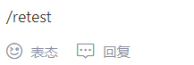
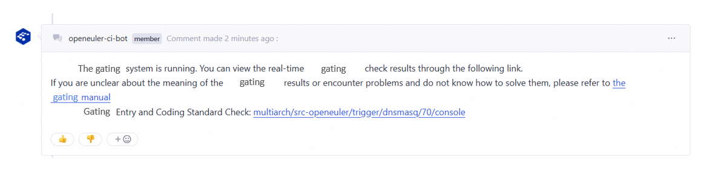
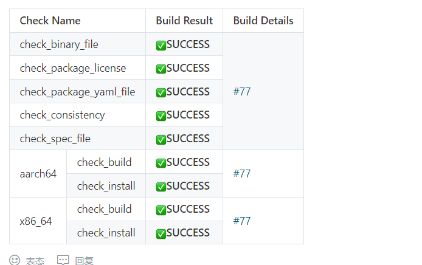
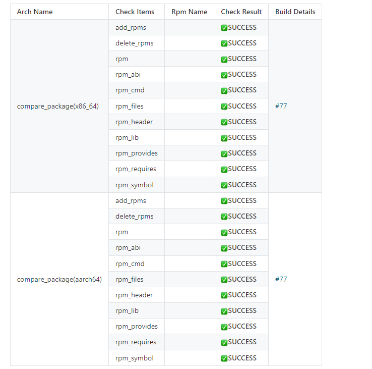
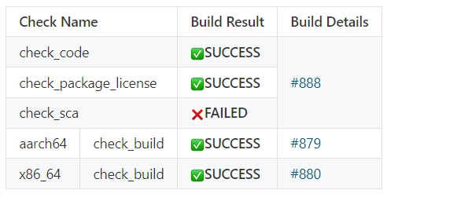
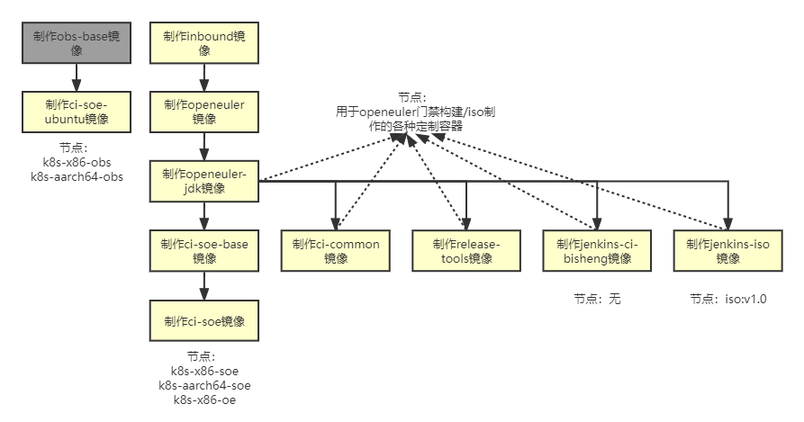

# Introduction to Gating

## 1. Gating

All openEuler community code is hosted on GitCode. To ensure code submission quality, when you submit a PR on GitCode, the gating system is automatically triggered to perform code style, build, installation, and interface change checks. The results of the gating checks are then returned in the PR comments, helping you identify issues and assisting maintainers in reviewing the code.

For the open-source gating code, see openeuler-jenkins on GitCode.

## 2. Gating Checks for src-openeuler

### 2.1 Triggering Gating

Gating is triggered when a PR is submitted for the first time or when you comment **/retest**.



### 2.2 Gating Start Flag



You can view the real-time gating build logs via the provided link.

### 2.3 Gating Check Results

<center><b>Basic checks</b></center>



<center><b>Interface change checks</b></center>



The basic gating checks include six items, as shown in Table 1. Interface change checks include more sub-items and are therefore presented in a separate table.

### 2.4 Check Items and Corresponding Gating Code Locations

| Check Item                 | Description              | Main Code Location                                                |
| ----------------------- | ---------------------- | ------------------------------------------------------------ |
| check_binary_file       | Binary file check        | [check_binary_file.py] on GitCode|
| check_package_license   | License compliance check     | [check_license.py], [check_openeuler_license.py], and [package_license.py] on GitCode|
| check_package_yaml_file | YAML file format check      | [check_yaml.py] and [check_repo.py] on GitCode|
| check_spec_file         | SPEC file format check      | [check_spec.py] on GitCode|
| check_consistency       | Source code consistency check    | [check_consistency.py] on GitCode|
| check_build             | Package build check                | [osc_build_k8s.py] on GitCode|
| check_install           | Package installation verification| [extra_work.py] on GitCode|
| compare_package         | Interface change check          | [compare_package.py] on GitCode|

Additionally, the gating system currently supports selective configuration for some check items (check_code_style, check_package_license, check_package_yaml_file, and check_spec_file). The configuration file is stored in [ac.yaml] on GitCode. The code responsible for displaying PR output of check results is stored in [gitee_comment.py] on GitCode.

### 2.5 Basic Checks Description

| Check Item                 | Function                                                        | SUCCESS                                                      | FAILED              | WARNING                                         |
| ----------------------- | ------------------------------------------------------------ | ------------------------------------------------------------ | ------------------- | ----------------------------------------------- |
| check_binary_file       | Check whether the repository contains binary files.                                | No files with extensions **.pyc**, **.jar**, **.ko**, **.o** exist (including files inside archives, but excluding upstream links)| Any violation of SUCCESS| N/A                                         |
| check_package_license   | Check the license validity.                                           | All licenses are in the trustlist, and the source code is consistent with that of the licenses listed in the SPEC file.           | A license in the blocklist is found.  | All licenses are in the trustlist, but the source code is inconsistent with that of the licenses listed in the SPEC file.|
| check_package_yaml_file | Check the YAML file format.                                                | The **version_control**, **src_repo**, **tag_prefix** and **separator** fields are complete, and the content of the **version_control** field is the same as the domain name specified in the **url** field in the SPEC file.| Any violation of SUCCESS| N/A                                         |
| check_spec_file         | Check the validity of the SPEC file.                                              | If the version number remains unchanged, the release number must be incremented; if the version number changes, the release number must be set to **1**. All patches must be applied during compilation, and the **changelog** format must be correct.| Any violation of SUCCESS| N/A                                         |
| check_consistency       | Check whether the SHA256 values of the remote and local source code files are the same to determine whether the source code package is changed.| The SHA256 values of the remote and local source code files are the same.                            | Any violation of SUCCESS| N/A                                         |
| check_build             | Verify the build.                                                    | The RPM package is successfully built.                                               | Any violation of SUCCESS| N/A                                         |
| check_install           | Verify the installation.                                                    | The RPM package is successfully installed.                                       | Any violation of SUCCESS| N/A                                         |

### 2.6 Interface Change Check Items and Functions

| Check Item      | Function                                       | SUCCESS                                                      | FAILED              | WARNING |
| ------------ | ------------------------------------------- | ------------------------------------------------------------ | ------------------- | ------- |
| add_rpms     | Check whether the RPM package is added in the PR.                        | Compared with the last successfully merged PR in the same branch, no RPM package is added in the PR.                   | Any violation of SUCCESS| N/A |
| delete_rpms  | Check whether the RPM package is deleted from the PR.                        | Compared with the last successfully merged PR in the same branch, no RPM package is deleted from the PR.                   | Any violation of SUCCESS| N/A |
| rpm          | Directory for storing the comparison result of the RPM package files                      | Compared with the last successfully merged PR in the same branch, the comparison result of the RPM package files remains unchanged.           | Any violation of SUCCESS| N/A |
| check_abi    | Check whether the binary interfaces (C++) of the RPM package generated in the PR change. | Compared with the last successfully merged PR in the same branch, the binary interfaces of each RPM package do not change.     | Any violation of SUCCESS| N/A |
| rpm_cmd      | Directory for storing the comparison result of the RPM command files                  | Compared with the last successfully merged PR in the same branch, the command files of each RPM package remain unchanged.       | Any violation of SUCCESS| N/A |
| rpm_files    | Check whether files are added to or deleted from RPM packages generated in the PR.      | Compared with the last successfully merged PR in the same branch, the file list of each RPM package does not change. (File changes are not checked.)| Any violation of SUCCESS| N/A |
| rpm_header   | Directory for storing the comparison result of the RPM header files                    | Compared with the last successfully merged PR in the same branch, the header files provided by each RPM package remain unchanged.     | Any violation of SUCCESS| N/A |
| rpm_lib      | Directory for storing the comparison result of the RPM so library files                  | Compared with the last successfully merged PR in the same branch, the `.so` library file provided by each RPM package remains unchanged.   | Any violation of SUCCESS| N/A |
| rpm_provides | Check whether the components in RPM packages generated in the PR change.| Compared with the last successfully merged PR in the same branch, the component names in each RPM package do not change.   | Any violation of SUCCESS| N/A |
| rpm_requires | Check whether the dependencies of the RPM package generated in the PR change.        | Compared with the last successfully merged PR in the same branch, the dependency names of each RPM package do not change.   | Any violation of SUCCESS| N/A |
| rpm_symbol   | Check whether the binary interfaces (C++) of the RPM package generated in the PR change. | Compared with the last successfully merged PR in the same branch, the binary interfaces of each RPM package do not change.     | Any violation of SUCCESS| N/A |

## 3 openEuler Gating Checks

### 3.1 PR Output of Gating Checks



### 3.2 Check Items and Corresponding Gating Code Locations

| Check Item               | Description                       | Main Code Location                                                |
| --------------------- | ------------------------------- | ------------------------------------------------------------ |
| check_code            | Coding specification check                   | [check_code.py] on GitCode|
| check_package_license | Check the license validity.              | [check_license.py], [check_openeuler_license.py], and [package_license.py] on GitCode|
| check_sca             | Code snippet scan                   | [check_sca.py] on GitCode|
| x86-64/*repository_name*        | Package build and post-build checks in x86-64 environment | Implemented by maintainers and not part of the gating code                              |
| aarch64/*repository_name*       | Package build and post-build check in the AArch64 environment| Same as above                                                        |

In addition, the access control system supports the optional configuration of check items (check_openlibing and check_sca). The configuration file is stored in [ac.yaml] on GitCode. The code responsible for displaying PR output of check results is stored in [gitee_comment.py] on GitCode.

Currently, both [check_openlibing] and [check_sca] on GitCode rely on remote services for implementation.

# Q&A and False Positive Feedback for Gating Results

## 1. Gating Responsibility Assignment

| Responsibility                                                      | Maintainer                                                   |
| ------------------------------------------------------------ | ------------------------------------------------------------ |
| Overall gating contact                                                | [wanghuan158] on GitCode|
| community repository maintainers                                       | [georgecao], [liuqi469227928], and [dakang_siji] on GitCode|
| obs_meta repository maintainer                                        | [dongjie110] on GitCode|
| release_management repository maintainer                              | [dongjie110] on GitCode|
| Maintainer of the single-repository gating of software packages                                      | [wanghuan158] and [MementoMoriCheng] on GitCode|
| Infrastructure maintenance personnel (including OBS, GitCode, Jenkins basic services, as well as hardware and network)| [georgecao], [liuqi469227928], and [dakang_siji] on GitCode|
| OBS project maintainer                                             | [wangchong1995924], [small_leek], and [dongjie110] on GitCode|
| Majun platform maintainer                                               | [openlibing@163.com](openlibing@163.com)                     |

Notes:

1. The code snippet scan (check_sca) and coding style check (check_code) in the single-repository gating of software packages are implemented by calling the Majun platform service.
2. The maintainers of the single-repository gating of software packages serve as the point of contact for both openEuler and src-openeuler single-repository gating issues. For issues related to OBS or infrastructure services, the corresponding maintainers should be contacted. For common problems and solutions, see [Gating Troubleshooting Manual] on GitCode.

## 2. Gating Results

If you have questions about the gating results or believe the results are inaccurate, you can report the issue to the responsible maintainer. We will resolve it as soon as possible. For issues that cannot be resolved quickly, you can submit an issue to [openeuler-jenkins](https://GitCode.com/openeuler/openeuler-jenkins) to track progress. After that, you can also report false positives through PR comments. Collecting these statistics helps us improve the gating system over time.

Format for marking false positives in comments: **/ci_unmistake build_no** or **/ci_mistake build_no <mistake_type> <ci_mistake_stage>**

Notes:

1. **ci_mistake** is used to mark a false positive, while **ci_unmistake** is used to revoke a false positive mark. One of them must be used.
2. **build_no** refers to the build number of the trigger project. When the gating process starts, the comment will display the link to the gating task along with its build number. Since a single PR may have multiple builds, the build number is used to differentiate between them. This is a mandatory parameter.
3. **mistake_type** indicates the false positive type. This parameter is optional. You can select **ci** (access control), **obs**, or **infra** (infrastructure) or leave it blank.
4. **ci_mistake_stage** indicates the stage of the false positive. This parameter is optional. You can select one or more items from check_binary_file, check_package_license, check_package_yaml_file, check_spec_file, check_build, check_install, compare_package, and build_exception, or leave it blank. All items except build_exception correspond to gating check items. build_exception indicates that the gating system runs abnormally (for example, the gating result is not returned).
5. The sequence of **mistake_type** and **ci_mistake_stage** can be changed.

# Gating Code Release Process

The release process for gating code consists of three steps in sequence: 1. Submit a PR to the gating code repository and have it merged (contact the maintainer). 2. Create a tag for the submission (contact the maintainer). 3. Update the container image (contact the gating personnel: [wanghuan158] and [MementoMoriCheng] on GitCode. In a few cases, the gating personnel need to modify the Jenkins configuration.

## 1. Submitting and Merging a PR

The gating code is hosted at [openeuler-jenkins](https://GitCode.com/openeuler/openeuler-jenkins). Contact the maintainer to merge the code.

## 2. Generating a Tag

In theory, a tag can be created for each submission. Tags are more human-readable compared with commit IDs. In general, not every merged PR needs to go live immediately, so it is not necessary to create a tag for every commit.


## 3. Building a Container Image

The machine environment for gating code is packaged into a container image. Therefore, every time the gating code is updated, the container image must also be updated for the changes to take effect. Container image versions are distinguished by tags.

# Customizing Running Nodes

## 1. Current Node/Image List



The following table lists the nodes related to gating:

| Node                                                        | Project                                  |
| ------------------------------------------------------------ | -------------------------------------- |
| k8s-x86-soe and k8s-aarch64-soe                                | All access control projects in src-openEuler             |
| k8s-x86-oe                                                   | The trigger and comment projects in openEuler       |
| **k8s-x86-openeuler, k8s-x86-openeuler-20.03-lts, k8s-x86-openeuler-20.03-lts-sp1, k8s-x86-openeuler-20.03-lts-sp2, k8s-x86-openeuler-20.03-lts-sp3, k8s-x86-openeuler-20.09, k8s-x86-openeuler-21.03, k8s-aarch64-openeuler, k8s-aarch64-openeuler-20.03-lts, k8s-aarch64-openeuler-20.03-lts-sp1, k8s-aarch64-openeuler-20.03-lts-sp2, k8s-aarch64-openeuler-20.03-lts-sp3, k8s-aarch64-openeuler-20.09, k8s-aarch64-openeuler-21.03**| **x86-64 and aarch64 build projects in openEuler**|

Notes:

1. All gating projects in src-openeuler, as well as the trigger and comment projects in openEuler, share a unified gating configuration and environment. Therefore, the nodes for these projects are fixed.
2. The code executed by the x86-64 and AArch64 build projects in openEuler is managed by respective SIG groups and is used in different environments. You can select the nodes **in bold**. To avoid affecting other Jenkins tasks, do not use other nodes.

## 2. Node Customization

Some tasks may require customizing gating running nodes.

### 2.1 Basic Image Lacks Dependencies and Dependency Installation Is Time-Consuming at Runtime

The gating container environment allows installing dependencies at runtime. For a small number of missing packages, it is advised to install them directly using the **sudo yum install -y xxx** command. If you need to install a large number of dependencies, submit a dockerfile to [openeuler-jenkins](https://GitCode.com/openeuler/openeuler-jenkins) on GitCode. The access control side reviews and integrates the dockerfile, creates an image, and then creates a running node.

For details about the dockerfile format, see release-tools-dockerfile on GitCode. Generally, you only need to modify the first two statements.

```shell
FROM swr.cn-north-4.myhuaweicloud.com/openeuler/openjdk/OPENJDK:TAG
RUN set -eux; \
    yum install -y python3-pip cpio bsdtar expect openssh sudo vim git strace python-jenkins python3-requests python-concurrent-log-handler python3-gevent python3-marshmallow python3-pyyaml python-pandas python-xlrd python-retrying python-esdk-obs-python git 
```

### 2.2 Basic Image Is Not openEuler

In addition to compiling the dockerfile, you need to provide the basic image of the corresponding version.

### 2.3 Server Architecture Does Not Meet Requirements

In addition to the preceding two requirements, you need to deploy a server of the corresponding architecture, and then perform steps 2.1 and 2.2. In this case, the gating code needs to be adapted.
