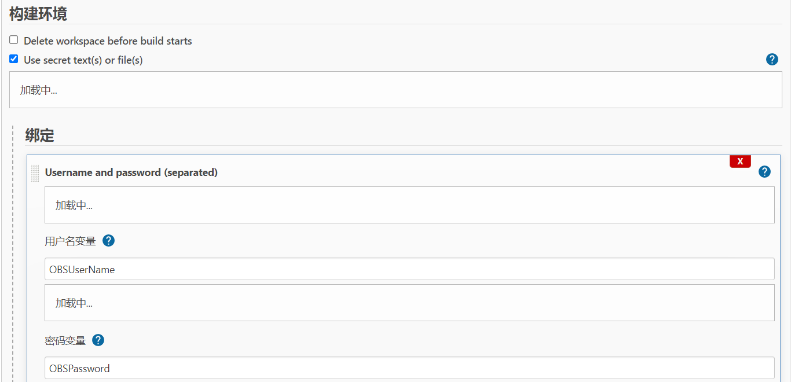
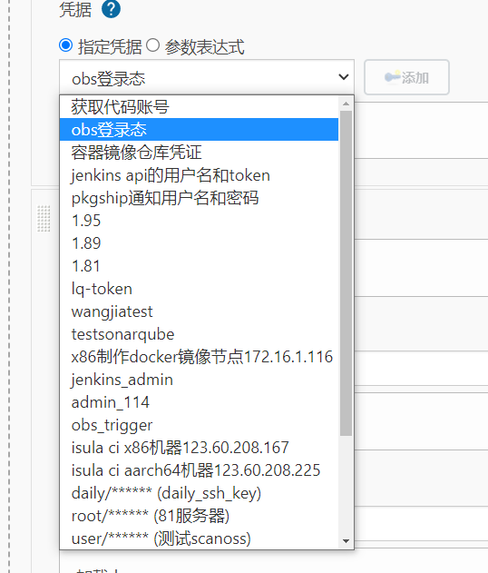
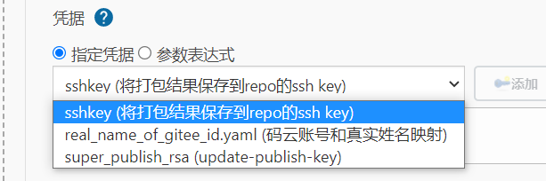
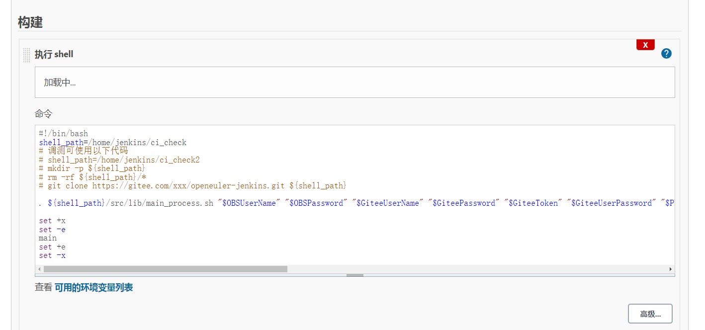
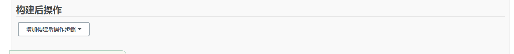

# Jenkins build简介

#### 下图是构建任务设置界面，可以看到上方的几个选项"General", "源码管理"， "构建触发器"，"构建环境"， "构建"， "构建后操作"。下面逐一介绍。


## 1.General

General是构建任务的一些基本配置。名称，描述之类的。

**描述:** 对构建任务的描述。 


**丢弃旧的构建：** 服务器资源是有限的，有时候保存了太多的历史构建，会导致Jenkins速度变慢，并且服务器硬盘资源也会被占满。当然下方的"保持构建天数" 和 保持构建的最大个数是可以自定义的，需要根据实际情况确定一个合理的值。


**参数化构建：** 此处参数允许提示用户输入一个或多个数据传递到构建中。例如，可能有一个项目通过允许用户上传包含要测试的二进制文件的 zip 文件来按需运行测试，可以通过在此处添加文件参数来完成。或者可能有一个发布某些软件的项目，并且希望用户输入将与软件一起上传的发布说明，也可以通过在此处添加参数来完成。每个参数都有一个具体的唯一的名称，并且和参数类型相关。这些**名称-值**对将在构建开始时作为环境变量导出，从而允许构建配置的后续部分（例如构建步骤）访问这些值。当一个项目配置参数时，提示用户为每个定义的参数指定值。如果用户选择不输入任何内容，则构建将从每个参数的默认值开始。


**以下以gcc为例说明具体需要配置的参数**

| 参数名称           | 描述              | 默认值                                                       | 是否必须参数 | 作用说明                                                     |
| ------------------ | ----------------- | ------------------------------------------------------------ | ------------ | ------------------------------------------------------------ |
| repo               | 码云中仓库名称    | gcc                                                          | 是           | 仓库名，构建整个过程都需要的参数                             |
| branch             | pr 源分支         | 无                                                           | 是           | 编译软件包和执行install过程中，记录日志时需要记录源分支信息  |
| tbranch            | pr 目标分支       | 无                                                           | 是           | 从具体的目标分{tbranch}支下载源码及关联仓库代码，编译软件包、比较软件包差异也需目标分支参数 |
| arch               | cpu框架           | aarch64/x86_64                                               | 是           | 具体的内核架构参数                                           |
| package            | 所属obs包         | gcc                                                          | 是           | 编译软件包过程中遍历该参数，判断是否含有特殊指定的包，执行具体的构建过程 |
| buddy              | 关联包repo        | gcc                                                          |              | 某些仓库编译依赖其他仓库代码，此值是必须的                   |
| prid               | 提交的pr id       | 无                                                           | 是           | 具体的pr id，具有唯一性                                      |
| committer          | 提交者            | 无                                                           | 是           | 比较软件包差异生成比较报告中需记录具体的提交者               |
| commentid          | 唯一的评论id      | 无                                                           | 是           | 编译软件包执行具体的构建过程中需要此参数，封装为字典格式后发送到kafka生产队列等待消费 |
| repo_server        | 结果保存地址      | 121.36.53.23                                                 | 是           | 相关结果文件保存地址                                         |
| pkgship_notify_url | 通知 pkgship 网址 | https://jenkins.osinfra.cn/job/openEuler_APPs/build-package-manage-image/build |              | 编译指定软件包（pkgship）过程中执行extra work需要的参数      |
| obs_rpm_host       | obs 归档地址      | http://119.3.219.20:82                                       | 否           | 最后编译完成后相关文件的存放地址                             |
| obs_webui_host     | obs 地址          | http://117.78.1.88/                                          | 否           | obs网址，可以查看对应工程、包的编译结果                      |


**限制项目的运行节点：**

默认情况下，可以在任何可用且配置为接受新构建的代理上执行此项目的构建。选中此选项后，可以确保此项目的构建仅发生在某个代理或一组代理上。例如，如果项目应该只构建在某个操作系统上，或者安装在安装了特定工具集的机器上，或者甚至是一台特定的机器上，您可以限制该项目仅在满足这些条件的代理上执行，即使当前节点需要排队，其他节点空闲，也不会在其他节点上跑

**节点选择** 根据所需架构不同选择对应的节点，openeuler主要分为x86和aarch64两种，即可构建对应docker镜像，里面包含一些包的安装和配置文件等。

## 2.源码管理

源码管理就是配置你代码的存放位置。


**Git:** 支持主流的github 和gitlab代码仓库。

## **3.构建触发器**

构建触发器，顾名思义，就是构建任务的触发器。


**触发远程构建(例如，使用脚本):** 该选项会提供一个接口，可以用来在代码层面触发构建。

**其他工程构建后触发：** 该选项意思是"在其他projects构建后构建"。

**定时构建：** 周期性的构建。很好理解，就是每隔一段时间进行构建。

**Gitee webhook 触发构建：** 当有更改push到gitee代码仓库，即触发构建。后面会有一个触发构建的地址，一般被称为webhooks。需要将这个地址配置到gitee中。

**轮询 SCM：** 该选项是配合上面这个选项使用的。当代码仓库发生改动，jenkins并不知道。需要配置这个选项，周期性的去检查代码仓库是否发生改动。

## 4.构建环境

构建环境就是构建之前的一些准备工作，如指定构建工具



此处的参数用途是shell脚本及其构建步骤（步骤5中）中需要用到的。 每个绑定值都将定义一个环境变量。

**参数介绍**

| 参数名称          | 描述                         | 是否必须参数 | 作用说明                                                     |
| ----------------- | ---------------------------- | ------------ | ------------------------------------------------------------ |
| OBSUserName       | obs用户名                    | 是           | 配置osc需要用户名密码                                        |
| OBSPassword       | obs密码                      | 是           | 配置osc需要用户名密码                                        |
| GiteeUserName     | 码云账号名                   | 是           | 下载源代码、依赖其他仓库代码需要gitee用户名密码              |
| GiteePassword     | 码云密码                     | 是           | 下载源代码、依赖其他仓库代码需要gitee用户名密码              |
| GiteeToken        | 码云token                    | 是           | 比较软件包差异，通过gitee的api接口读取提交的pr内容需要token  |
| GiteeUserPassword | 码云用户账号名               | 是           | 码云账户名（xxx@gitee.com，@之前的部分）                     |
| PkgShipUserName   | PkgShip通知用户名            | 否           | 编译指定软件包（pkgship）过程中执行extra work需要的参数      |
| PkgShipPassword   | PkgShip通知密码              | 否           | 编译指定软件包（pkgship）过程中执行extra work需要的参数      |
| SaveBuildRPM2Repo | 打包好的结果保存到repo的地址 | 是           | 编译软件包、比较软件包差异过程结束后，将此处结果复制到远端服务器 |

以上所有参数的凭据皆以**指定凭据**的方式保存，需要提前配置好





### 凭证管理
存储在Jenkins中的credentials可以被使用，适用于Jenkins的任何地方 (即全局 credentials),

查看当前凭证
https://openeulerjenkins.osinfra.cn/credentials/

添加新凭证
https://openeulerjenkins.osinfra.cn/credentials/store/system/domain/_/newCredentials

Jenkins可以存储以下类型的credentials:

Secret text - API token之类的token (如GitHub个人访问token)

Username and password - 可以为独立的字段，也可以为冒号分隔的字符串(更多信息请参照 处理 credentials)

Secret file - 保存在文件中的加密内容

SSH Username with private key - SSH 公钥/私钥对

Certificate - a PKCS#12 证书文件 和可选密码

**ID：** 在 ID 字段中，必须指定一个有意义的Credential ID，注意: 该字段是可选的。 如果没有指定值, Jenkins 则Jenkins会分配一个全局唯一ID（GUID）值。

## 5.构建



**执行shell**： 执行shell命令，该工具是针对linux环境的，windows环境也有对应的工      具"Execute Windows batch command"。 在构建之前，可能我们需要执行一些命令，比如压缩包的解压之类的。如下所示

```shell
#!/bin/bash
shell_path=/home/jenkins/ci_check
# 调测可使用以下代码
# shell_path=/home/jenkins/ci_check2
# mkdir -p ${shell_path}
# rm -rf ${shell_path}/*
# git clone https://gitee.com/xxx/openeuler-jenkins.git ${shell_path}

. ${shell_path}/src/lib/main_process.sh "$OBSUserName" "$OBSPassword" "$GiteeUserName" "$GiteePassword" "$GiteeToken" "$GiteeUserPassword" "$PkgShipUserName" "$PkgShipPassword" "$buddy" "$repo" "$tbranch" "$arch" "$package" "$branch" "$prid" "$WORKSPACE" "$committer" "$commentid" "$SaveBuildRPM2Repo" "$repo_server" "$pkgship_notify_url" "$pkgship_notify_token"

set +x
set -e
main
set +e
set -x
```

## **6.构建后操作**

构建后操作，就是对project构建完成后的一些后续操作，比如生成相应的代码测试报告。



此处相关操作在trigger阶段配置

## 7、构建结果说明

**构建状态**

**Successful蓝色**：构建完成，并且被认为是稳定的。

**Unstable黄色**：构建完成，但被认为是不稳定的。

**Failed红色**：构建失败。

**Disable灰色**：构建已禁用

**构建稳定性**

构建稳定性用天气表示：**晴、晴转多云、多云、小雨、雷阵雨**。天气越好表示构建越稳定，反之亦然。


