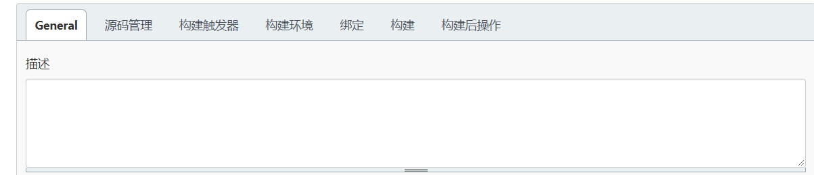
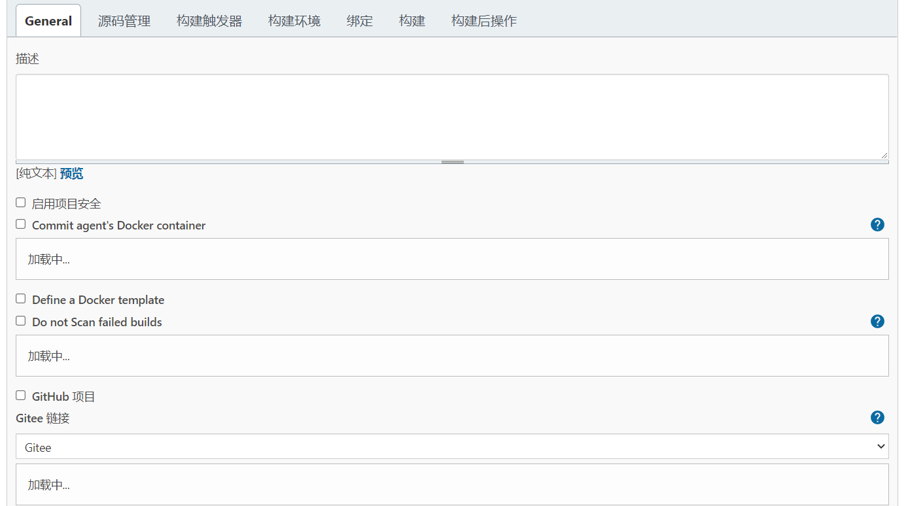
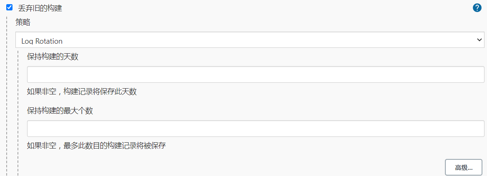
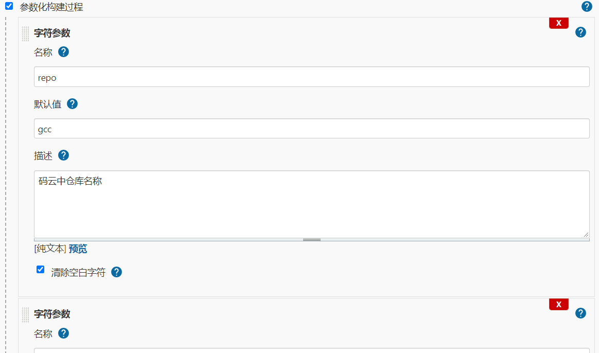
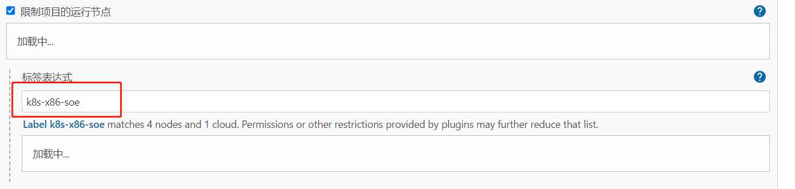
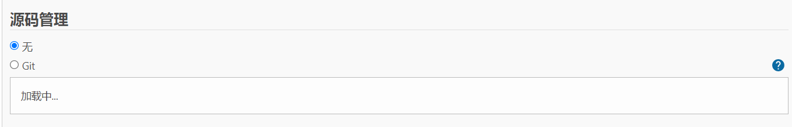
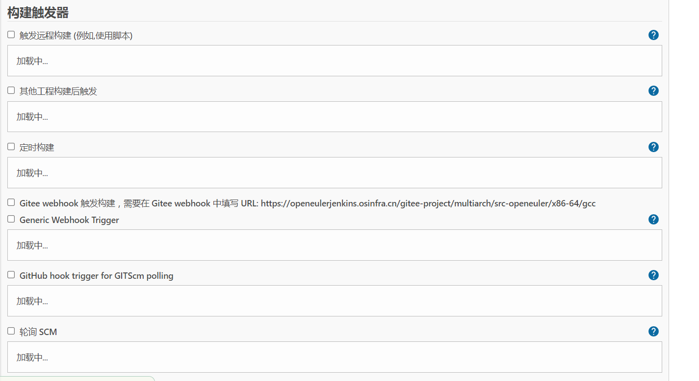
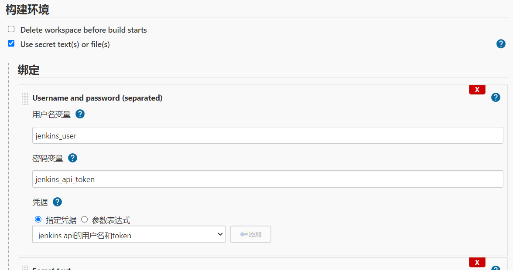
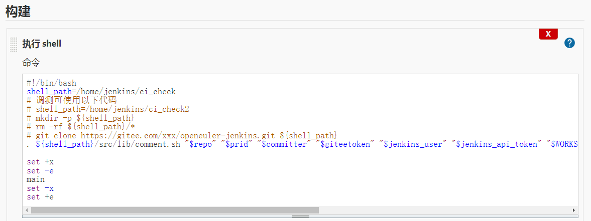
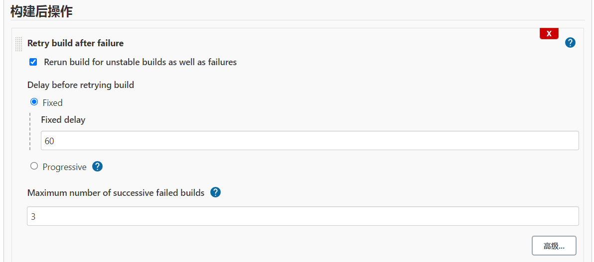

# Jenkins comment简介

#### 下图是构建任务设置界面，可以看到上方的几个选项"General",  "源码管理"， "构建触发器"，"构建环境"， "构建"， "构建后操作"。下面逐一介绍。



## 1.General

General是构建任务的一些基本配置。名称，描述之类的。

**描述:** 对构建任务的描述。 



**丢弃旧的构建：** 服务器资源是有限的，有时候保存了太多的历史构建，会导致Jenkins速度变慢，并且服务器硬盘资源也会被占满。当然下方的"保持构建天数" 和 保持构建的最大个数是可以自定义的，需要根据实际情况确定一个合理的值。



**参数化构建：** 此处参数允许提示用户输入一个或多个数据传递到构建中。例如，可能有一个项目通过允许用户上传包含要测试的二进制文件的 zip 文件来按需运行测试，可以通过在此处添加文件参数来完成。或者可能有一个发布某些软件的项目，并且希望用户输入将与软件一起上传的发布说明，也可以通过在此处添加参数来完成。每个参数都有一个具体的唯一的名称，并且和参数类型相关。这些**名称-值**对将在构建开始时作为环境变量导出，从而允许构建配置的后续部分（例如构建步骤）访问这些值。当一个项目配置参数时，提示用户为每个定义的参数指定值。如果用户选择不输入任何内容，则构建将从每个参数的默认值开始。



**以下以gcc为例说明具体需要配置的参数**

| 参数名称       | 描述                | 默认值       | 是否必须参数 | 作用说明                                                     |
| -------------- | ------------------- | ------------ | ------------ | ------------------------------------------------------------ |
| repo           | 码云中仓库名称      | gcc          | 是           | 仓库名，构建整个过程都需要的参数                             |
| branch         | pr 源分支           | 无           | 是           | 源分支                                                       |
| tbranch        | pr 目标分支         | 无           | 是           | pr目标分支                                                   |
| ACL            | 环境变量            | []           | 是           | 环境变量                                                     |
| prtitle        | pr标题              | 无           | 是           | 暂无                                                         |
| prid           | 提交的pr id         | 无           | 是           | 具体的pr id，具有唯一性                                      |
| committer      | 提交者              | 无           | 是           | 最终生成评论时，通知committer                                |
| commentid      | 唯一的评论id        | 无           | 是           | 封装为字典格式后发送到kafka队列                              |
| repo_server    | 结果保存地址        | 121.36.53.23 | 是           | 相关结果文件保存地址                                         |
| jobtriggertime | trigger工程触发时间 | 无           | 是           | 构建时间(单位秒)                                             |
| prcreatetime   | pr创建时间          | 无           | 是           | pr创建时间戳                                                 |
| prurl          | pr url              | 无           | 是           | 需要进行上报的pr地址，(pr_url, build_no)共同确定一次门禁结果 |
| triggerbuildid | trigger的构建号     | 无           | 是           | 整体构建号                                                   |



**限制项目的运行节点：**

默认情况下，可以在任何可用且配置为接受新构建的代理上执行此项目的构建。选中此选项后，可以确保此项目的构建仅发生在某个代理或一组代理上。例如，如果项目应该只构建在某个操作系统上，或者安装在安装了特定工具集的机器上，或者甚至是一台特定的机器上，您可以限制该项目仅在满足这些条件的代理上执行，即使当前节点需要排队，其他节点空闲，也不会在其他节点上跑

**节点选择** 根据所需架构不同选择对应的节点，openeuler主要分为x86和aarch64两种，即可构建对应docker镜像，里面包含一些包的安装和配置文件等。

## 2.源码管理

源码管理就是配置你代码的存放位置。



**Git:** 支持主流的github 和gitlab代码仓库。

## **3.构建触发器**

构建触发器，顾名思义，就是构建任务的触发器。



**触发远程构建(例如，使用脚本):** 该选项会提供一个接口，可以用来在代码层面触发构建。

**其他工程构建后触发：** 该选项意思是"在其他projects构建后构建"。

**定时构建：** 周期性的构建。很好理解，就是每隔一段时间进行构建。

**Gitee webhook 触发构建：** 当有更改push到gitee代码仓库，即触发构建。后面会有一个触发构建的地址，一般被称为webhooks。需要将这个地址配置到gitee中。

**轮询 SCM：** 该选项是配合上面这个选项使用的。当代码仓库发生改动，jenkins并不知道。需要配置这个选项，周期性的去检查代码仓库是否发生改动。

## 4.构建环境

构建环境就是构建之前的一些准备工作，如指定构建工具



此处的参数用途是shell脚本及其构建步骤（步骤5中）中需要用到的。 每个绑定值都将定义一个环境变量。

**参数介绍**

| 参数名称          | 描述                         | 是否必须参数 | 作用说明                                                     |
| ----------------- | ---------------------------- | ------------ | ------------------------------------------------------------ |
| jenkins_user      | jenkins用户名                | 是           | 初始化JenkinsProxy类的参数                                   |
| jenkins_api_token | jenkins  api token           | 是           | 初始化JenkinsProxy类的参数                                   |
| giteetoken        | 码云token                    | 是           | 通过gitee的api接口读取提交的pr内容需要token                  |
| SaveBuildRPM2Repo | 打包好的结果保存到repo的地址 | 是           | 编译软件包、比较软件包差异过程结束后，将此处结果复制到远端服务器 |

以上所有参数的凭据皆以**指定凭据**的方式保存，需要提前配置好

## 5.构建



**执行shell**： 执行shell命令，该工具是针对linux环境的，windows环境也有对应的工      具"Execute Windows batch command"。 在构建之前，可能我们需要执行一些命令，比如压缩包的解压之类的。如下所示

```shell
#!/bin/bash
shell_path=/home/jenkins/ci_check
# 调测可使用以下代码
# shell_path=/home/jenkins/ci_check2
# mkdir -p ${shell_path}
# rm -rf ${shell_path}/*
# git clone https://gitee.com/xxx/openeuler-jenkins.git ${shell_path}
. ${shell_path}/src/lib/comment.sh "$repo" "$prid" "$committer" "$giteetoken" "$jenkins_user" "$jenkins_api_token" "$WORKSPACE" "$SaveBuildRPM2Repo" "$repo_server" "$compare_result" "$commentid" "https://jenkins.openeuler.org/"

set +x
set -e
main
set -x
set +e
```

## **6.构建后操作**

构建后操作，就是对project构建完成后的一些后续操作。



此操作重新安排失败的构建。
注意：立即重新安排失败的构建， 配置适当的延迟或限制最大重试次数。

**Fixed delay：**对不稳定的构建和失败重新运行构建，延迟时间为60秒

**Maximum number of successive failed builds：**限制连续失败的构建重试。 设置为 0 表示没有限制。


