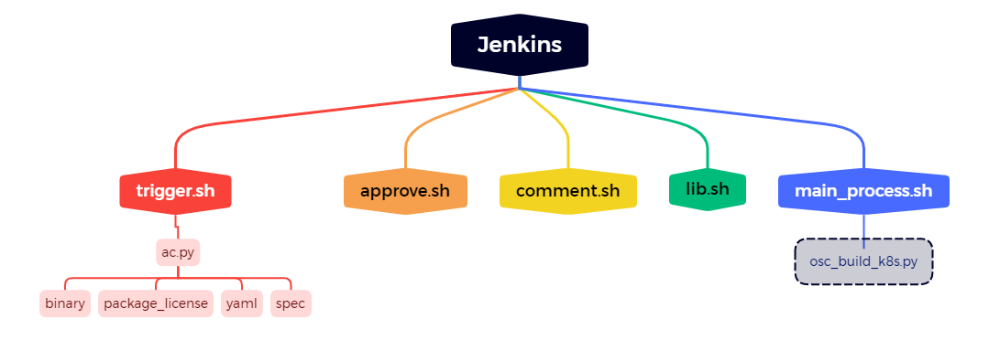
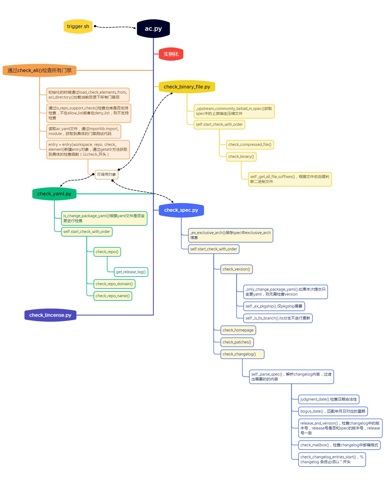
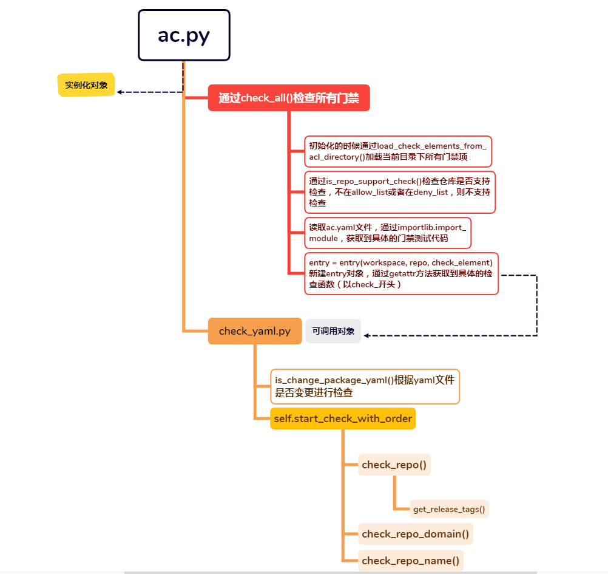
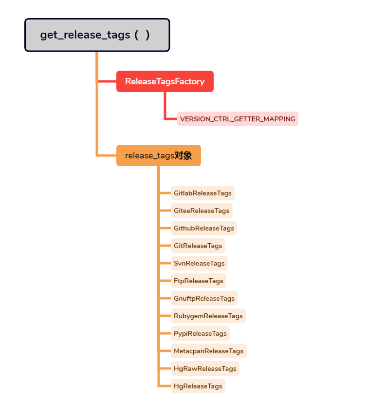
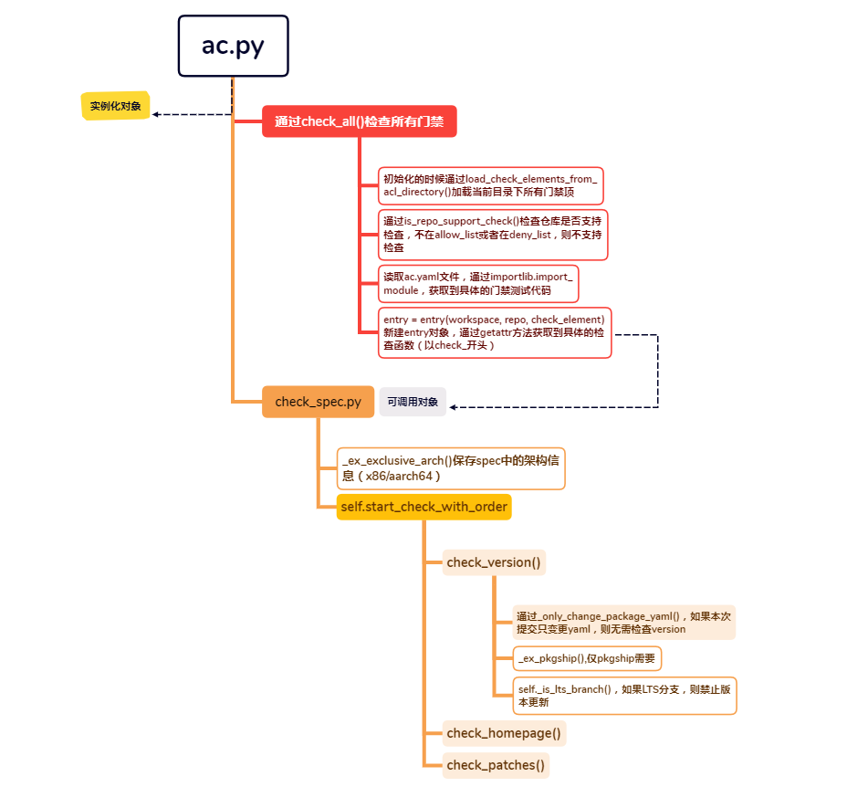
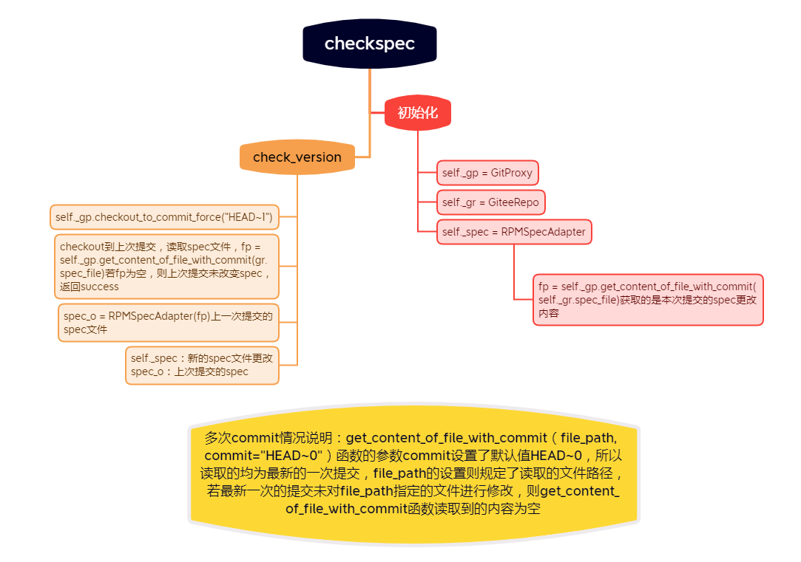
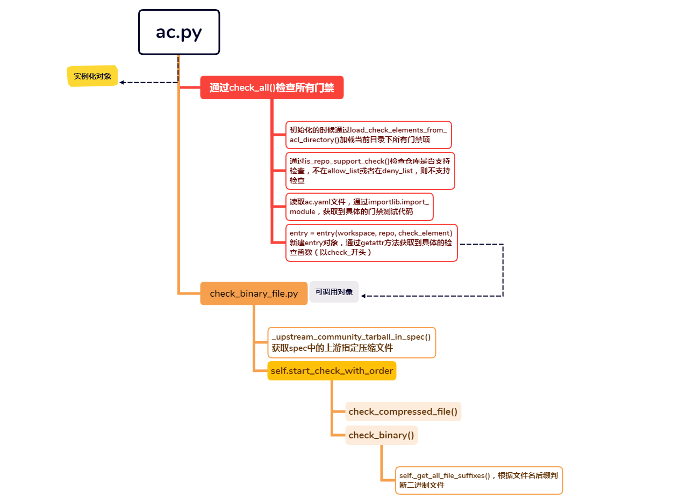
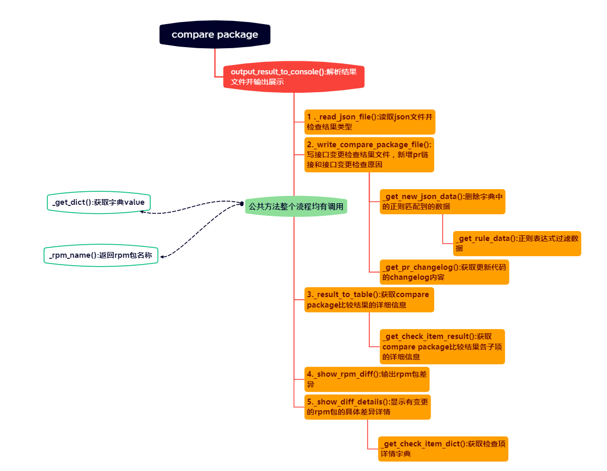
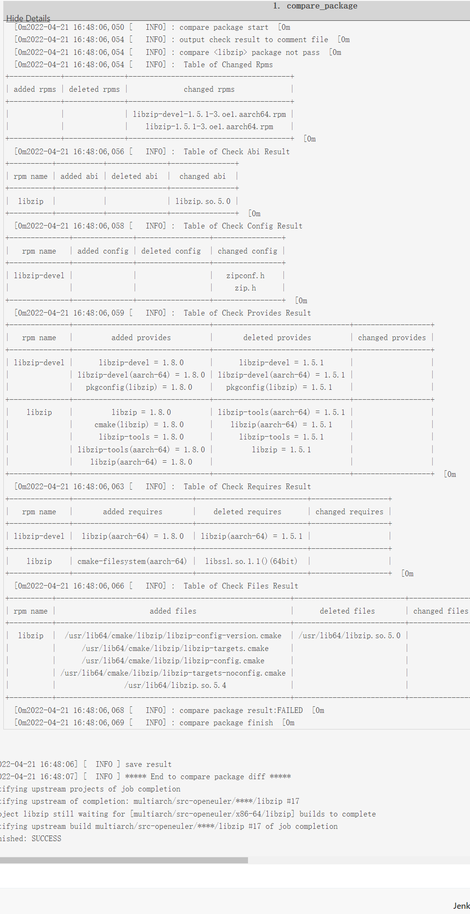
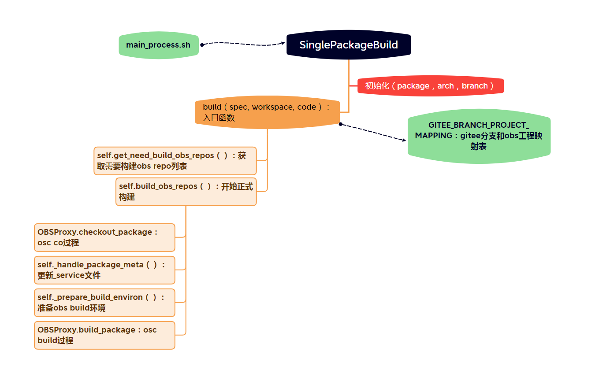

# 执行流程

#### 



## 1. Trigger.sh脚本

此脚本主要分为三个步骤

1、下载kernel代码

2、执行静态检查（license，spec等）

3、执行额外操作，目前只有pkgship仓库需要额外操作

ac.py文件主要在第二步中执行

```shell
function exec_check() {
  log_info "***** Start to exec static check *****"
  export PYTHONPATH=${shell_path}
  python3 ${shell_path}/src/ac/framework/ac.py \
    -w ${WORKSPACE} -r ${giteeRepoName} -o acfile -t ${GiteeToken} \
    -p ${giteePullRequestIid} -b ${giteeTargetBranch} -a ${GiteeUserPassword} \
    -x ${prCreateTime} -l ${triggerLink} -z ${jobTriggerTime} -m "${comment}" \
    -i ${commentID} -e ${giteeCommitter} --jenkins-base-url ${jenkins_api_host} \
    --jenkins-user ${jenkins_user} --jenkins-api-token ${jenkins_api_token}
  log_info "***** End to exec static check *****"
}
```

## 说明

```python
self._ac_check_elements
```

```json
{
	'spec': {
		'hint': 'check_spec_file',
		'module': 'spec.check_spec',
		'entry': 'CheckSpec',
		'ignored': ['homepage']
	},
	'code': {
		'hint': 'check_code_style',
		'module': 'code.check_code_style',
		'entry': 'CheckCodeStyle',
		'exclude': True,
		'ignored': ['patch']
	},
	'package_yaml': {
		'hint': 'check_package_yaml_file',
		'module': 'package_yaml.check_yaml',
		'entry': 'CheckPackageYaml',
		'ignored': ['fields']
	},
	'package_license': {
		'hint': 'check_package_license',
		'module': 'package_license.check_license',
		'entry': 'CheckLicense'
	},
	'binary': {
		'hint': 'check_binary_file',
		'module': 'binary.check_binary_file',
		'entry': 'CheckBinaryFile'
	},
	'sca': {
		'exclude': True
	},
	'openlibing': {
		'exclude': True
	}
}

{
	'version_control': 'git',
	'src_repo': 'https://code.wireshark.org/review/gitweb?p=wireshark.git',
	'tag_prefix': '^v',
	'seperator': '.'
}
```


## 2 package yaml

函数调用关系图



此文件夹中包含两个python文件

**1 check_yaml.py**

检查软件包中的yaml文件

| 类方法/属性            | 描述                   | 作用说明                                                     |
| ---------------------- | ---------------------- | ------------------------------------------------------------ |
| __init__               | 初始化                 | CheckPackageYaml实例化对象，初始设置一些参数值               |
| is_change_package_yaml | 判断是否更改了yaml文件 | 如果本次提交变更了yaml，则对yaml进行检查                     |
| check_fields           | 检查fileds             | 从具体的目标分{tbranch}支下载源码及关联仓库代码，编译软件包、比较软件包差异也需目标分支参数 |
| check_repo             | 检查repo               | 检查yaml的有效性,能否从上游社区获取版本信息                  |
| check_repo_domain      | 检查repo作用域         | 检查spec中source0域名是否包含yaml的version_control,仅做日志告警只返回SUCCESS(autoconf为特例) |
| check_repo_name        | 检查repo名称           | 检查spec中是否包含yaml中src_repo字段的软件名,仅做日志告警只返回SUCCESS |
| __call__               | ·                      | 使CheckPackageYaml的实例对象变为了可调用对象                 |

**2 check_repo.py**

获取上游社区的release tags



| 类名                 | 方法                 | 描述                                        | 作用说明                                       |
| -------------------- | -------------------- | ------------------------------------------- | ---------------------------------------------- |
| AbsReleaseTags       |                      | 获取release tags的抽象类                    |                                                |
| DefaultReleaseTags   |                      | 获取release tags的基类                      |                                                |
|                      | url                  |                                             | 通过src_repo生成url                            |
|                      | get_tags             |                                             | 通过url获取上游社区的release tags              |
| HttpReleaseTagsMixin |                      | 通过web请求形式获取release tags             |                                                |
|                      | get_redirect_resp    |                                             | 获取重定向的url和cookie                        |
|                      | get_request_response |                                             | 获取url请求获取response                        |
| HgReleaseTags        |                      | 获取hg上游社区release tags                  |                                                |
| HgRawReleaseTags     |                      | 获取hg raw上游社区release tags              |                                                |
| MetacpanReleaseTags  |                      | 获取metacpan上游社区release tags            |                                                |
| PypiReleaseTags      |                      | 获取pypi上游社区release tags                |                                                |
| RubygemReleaseTags   |                      | 获取rubygem上游社区release tags             |                                                |
| GnuftpReleaseTags    |                      | 获取gnu-ftp上游社区release tags             |                                                |
| FtpReleaseTags       |                      | 获取ftp上游社区release tags                 |                                                |
| CmdReleaseTagsMixin  |                      | 通过shell命令获取上游社区的release tags     |                                                |
|                      | get_cmd_response     |                                             | 获取shell命令的response                        |
| SvnReleaseTags       |                      | 通过shell svn命令获取上游社区的release tags |                                                |
| GitReleaseTags       |                      | 通过shell git命令获取上游社区的release tags |                                                |
|                      | trans_reponse_tags   |                                             | 解析git命令返回值为纯数字形式的tag             |
| GithubReleaseTags    |                      | 获取github上游社区release tags              |                                                |
| GiteeReleaseTags     |                      | 获取gitee上游社区release tags               |                                                |
| GitlabReleaseTags    |                      | 获取gitlab.gnome上游社区release tags        |                                                |
| ReleaseTagsFactory   |                      | ReleaseTags及其子类的工厂类                 |                                                |
|                      | get_release_tags     |                                             | 通过version control返回对应的ReleaseTags的子类 |

## 3 spec

**check_spec.py**



检查软件包中的spec文件



| 类方法/属性               | 描述                         | 作用说明                                  |
| ------------------------- | ---------------------------- | ----------------------------------------- |
| __init__                  | 初始化                       | CheckSpec实例化对象，初始设置一些参数值   |
| _only_change_package_yaml | 判断是否更改了yaml文件       | 如果本次提交只变更yaml，则无需检查version |
| _is_lts_branch            | 判断是否是lts分支            |                                           |
| check_version             | 检查版本信息                 | 检查当前版本号是否比上一个commit新        |
| check_homepage            | 检查spec文件中的主页url      | 检查主页是否可访问                        |
| check_patches             | 检查spec中的patch            | 检查spec中的patch是否存在                 |
| _ex_exclusive_arch        | 保存spec中exclusive_arch信息 |                                           |
| _ex_pkgship               | pkgship需求                  |                                           |
| __call__                  | ·                            | 使CheckSpec的实例对象变为了可调用对象     |


## 4 binary 

**check_binary_file.py**



检查压缩包中的二进制文件

| 类方法/属性                         | 描述                     | 作用说明                                      |
| ----------------------------------- | ------------------------ | --------------------------------------------- |
| __init__                            | 初始化                   | CheckBinaryFile实例化对象，初始设置一些参数值 |
| BINARY_LIST                         | 二进制文件后缀集         |                                               |
| check_compressed_file               | 解压缩包                 |                                               |
| check_binary                        | 检查二进制文件           |                                               |
| _upstream_community_tarball_in_spec | spec指定的上游社区压缩包 | 检查spec指定的上游社区压缩包                  |
| _get_all_file_suffixes              | 获取文件夹中文件后缀     | 获取当前文件中所有文件名后缀,并判断           |
| __call__                            | ·                        | 使CheckBinaryFile的实例对象变为了可调用对象   |

## 5 compare package



**compare package结果示例：**



| added rpms | deleted rpms | changed rpms                                                 |
| ---------- | ------------ | ------------------------------------------------------------ |
|            |              | libzip-devel-1.5.1-3.oe1.aarch64.rpm<br />libzip-1.5.1-3.oe1.aarch64.rpm |

Check Abi 

| rpm name | added abi | deleted abi | changed abi   |
| -------- | --------- | ----------- | ------------- |
| libzip   |           |             | libzip.so.5.0 |

Check Config

| rpm name     | added config | deleted config | changed config            |
| ------------ | ------------ | -------------- | ------------------------- |
| libzip-devel |              |                | zipconf.h   <br />\|zip.h |

Check Provides

| rpm name     | added provides                                               | deleted provides                                             | changed provides |
| ------------ | ------------------------------------------------------------ | ------------------------------------------------------------ | ---------------- |
| libzip-devel | libzip-devel = 1.8.0      <br />libzip-devel(aarch-64) = 1.8.0<br /> pkgconfig(libzip) = 1.8.0 <br /> | libzip-devel = 1.5.1      <br /> libzip-devel(aarch-64) = 1.5.1 <br />pkgconfig(libzip) = 1.5.1 |                  |
| libzip       | libzip = 1.8.0         <br />cmake(libzip) = 1.8.0 <br /> libzip-tools = 1.8.0 <br />libzip-tools(aarch-64) = 1.8.0<br />libzip(aarch-64) = 1.8.0 | libzip-tools(aarch-64) = 1.5.1 <br />libzip(aarch-64) = 1.5.1  <br /> libzip-tools = 1.5.1 <br /> libzip = 1.5.1 |                  |

Requires Result

| rpm name     | added requires             | deleted requires         | changed requires |
| ------------ | -------------------------- | ------------------------ | ---------------- |
| libzip-devel | libzip(aarch-64) = 1.8.0   | libzip(aarch-64) = 1.5.1 |                  |
| libzip       | cmake-filesystem(aarch-64) | libssl.so.1.1()(64bit)   |                  |

Check Files

| rpm name | added files                                                  | deleted files            | changed files |
| -------- | ------------------------------------------------------------ | ------------------------ | ------------- |
| libzip   | /usr/lib64/cmake/libzip/libzip-config-version.cmake  <br />/usr/lib64/cmake/libzip/libzip-targets.cmake<br /> /usr/lib64/cmake/libzip/libzip-targets-noconfig.cmake | /usr/lib64/libzip.so.5.0 |               |

compare package在extra work中进行调用

| 类方法/属性                 | 描述                                                  | 说明                                         |
| --------------------------- | ----------------------------------------------------- | -------------------------------------------- |
| __init__                    | 初始化                                                | ComparePackage实例化对象，初始设置一些参数值 |
| _get_dict                   | 获取字典值                                            | 公共方法                                     |
| _rpm_name                   | 返回rpm包名称                                         | 公共方法                                     |
| _show_rpm_diff              | 输出rpm包差异                                         |                                              |
| _get_check_item_dict        | 获取检查项详情字典                                    |                                              |
| _show_diff_details          | 显示有diff差异的rpm包的所有差异详情                   |                                              |
| output_result_to_console    | 解析结果文件并输出展示到jenkins上                     | 主入口                                       |
| _read_json_file             | 读取json文件并检查结果类型                            |                                              |
| _get_rule_data              | 根据正则表达式过滤数据                                |                                              |
| _get_new_json_data          | 得到新的json数据                                      | 删除字典中的正则匹配到的数据                 |
| _write_compare_package_file | 写接口变更检查结果文件，新增pr链接和接口变更检查原因  |                                              |
| _get_pr_changelog           | 获取更新代码的changelog内容，应包含变更检查原因及影响 |                                              |
| _get_check_item_result      | 获取compare package比较结果各子项的详细信息           |                                              |
| _result_to_table            | 获取compare package比较结果的详细信息                 |                                              |

**output_result_to_console()函数读取的数据结构如下：**

```json
{
	"old_path": "xxxx",
	"new_path": "xxxx",
	"compare_result": "not pass",
	"compare_details": {
		"more": {
			"more_num": 2,
			"more_details": [
				"1.rpm",
				"2.rpm"
			]
		},
		"diff": {
			"diff_num": 2,
			"diff_details": {
				"lib_stan": {
					"name": {
						"old": "xxx",
						"new": "xxx"
					},
					"rpm_abi": {
						"diff": {
							"old": [
								"a.so_1.0",
								"b.so_2.0"
							],
							"new": [
								"a.so_1.1",
								"b.so_2.1"
							]
						},
						"less": [],
						"more": []
					},
					"rpm_provides": {
						"e.g": [
							"a.so_1.1",
							"b.so_2.1"
						]
					}
				}
			}
		},
		"less": {
			"less_num": 2,
			"less_details": [
				"3.rpm",
				"4.rpm"
			]
		},
		"same": {
			"old": [],
			"new": []
		}
	}
}
```

**_get_pr_changelog()函数读取的数据结构如下：**

```json
{
	"url": "https://gitee.com/api/v5/repos/src-openeuler/time/commits/8041797958a159f6d01369a9011b2db3987721bf",
	"sha": "8041797958a159f6d01369a9011b2db3987721bf",
	"html_url": "https://gitee.com/src-openeuler/time/commit/8041797958a159f6d01369a9011b2db3987721bf",
	"comments_url": "https://gitee.com/api/v5/repos/src-openeuler/time/commits/8041797958a159f6d01369a9011b2db3987721bf/comments",
	"commit": {
		"author": {
			"name": "Lv Genggeng",
			"date": "2022-03-22T19:59:50+08:00",
			"email": "lvgenggeng@uniontech.com"
		},
		"committer": {
			"name": "Lv Genggeng",
			"date": "2022-03-22T19:59:50+08:00",
			"email": "lvgenggeng@uniontech.com"
		},
		"message": "add help opt cmdline\n\nSigned-off-by: Lv Genggeng \u003Clvgenggeng@uniontech.com\u003E\n",
		"tree": {
			"sha": "a571bcc758a3c29cd28a2e632fc1f80eb4efa6b6",
			"url": "https://gitee.com/api/v5/repos/src-openeuler/time/git/trees/a571bcc758a3c29cd28a2e632fc1f80eb4efa6b6"
		}
	},
	"author": {
		"id": 9903315,
		"login": "lvgenggeng",
		"name": "lvgenggeng",
		"avatar_url": "https://gitee.com/assets/no_portrait.png",
		"url": "https://gitee.com/api/v5/users/lvgenggeng",
		"html_url": "https://gitee.com/lvgenggeng",
		"remark": "",
		"followers_url": "https://gitee.com/api/v5/users/lvgenggeng/followers",
		"following_url": "https://gitee.com/api/v5/users/lvgenggeng/following_url{/other_user}",
		"gists_url": "https://gitee.com/api/v5/users/lvgenggeng/gists{/gist_id}",
		"starred_url": "https://gitee.com/api/v5/users/lvgenggeng/starred{/owner}{/repo}",
		"subscriptions_url": "https://gitee.com/api/v5/users/lvgenggeng/subscriptions",
		"organizations_url": "https://gitee.com/api/v5/users/lvgenggeng/orgs",
		"repos_url": "https://gitee.com/api/v5/users/lvgenggeng/repos",
		"events_url": "https://gitee.com/api/v5/users/lvgenggeng/events{/privacy}",
		"received_events_url": "https://gitee.com/api/v5/users/lvgenggeng/received_events",
		"type": "User"
	},
	"committer": {
		"id": 9903315,
		"login": "lvgenggeng",
		"name": "lvgenggeng",
		"avatar_url": "https://gitee.com/assets/no_portrait.png",
		"url": "https://gitee.com/api/v5/users/lvgenggeng",
		"html_url": "https://gitee.com/lvgenggeng",
		"remark": "",
		"followers_url": "https://gitee.com/api/v5/users/lvgenggeng/followers",
		"following_url": "https://gitee.com/api/v5/users/lvgenggeng/following_url{/other_user}",
		"gists_url": "https://gitee.com/api/v5/users/lvgenggeng/gists{/gist_id}",
		"starred_url": "https://gitee.com/api/v5/users/lvgenggeng/starred{/owner}{/repo}",
		"subscriptions_url": "https://gitee.com/api/v5/users/lvgenggeng/subscriptions",
		"organizations_url": "https://gitee.com/api/v5/users/lvgenggeng/orgs",
		"repos_url": "https://gitee.com/api/v5/users/lvgenggeng/repos",
		"events_url": "https://gitee.com/api/v5/users/lvgenggeng/events{/privacy}",
		"received_events_url": "https://gitee.com/api/v5/users/lvgenggeng/received_events",
		"type": "User"
	},
	"parents": [{
		"sha": "099ff388bceae72a9a55b96b96c1d8e4716ec0c8",
		"url": "https://gitee.com/api/v5/repos/src-openeuler/time/commits/099ff388bceae72a9a55b96b96c1d8e4716ec0c8"
	}],
	"stats": {
		"id": "8041797958a159f6d01369a9011b2db3987721bf",
		"additions": 21,
		"deletions": 1,
		"total": 22
	},
	"files": [{
		"sha": "00627ce001927a921f850b803dfaa30ee31172a9",
		"filename": "add-help-opt.patch",
		"status": "added",
		"additions": 13,
		"deletions": 0,
		"changes": 13,
		"blob_url": "https://gitee.com/src-openeuler/time/blob/8041797958a159f6d01369a9011b2db3987721bf/add-help-opt.patch",
		"raw_url": "https://gitee.com/src-openeuler/time/raw/8041797958a159f6d01369a9011b2db3987721bf/add-help-opt.patch",
		"content_url": "https://gitee.com/api/v5/repos/src-openeuler/time/contents/add-help-opt.patch?ref=8041797958a159f6d01369a9011b2db3987721bf",
		"patch": "@@ -0,0 +1,13 @@\n+diff --git a/src/time.c b/src/time.c\n+index 7e07995..231e8cb 100644\n+--- a/src/time.c\n++++ b/src/time.c\n+@@ -657,7 +657,7 @@ getargs (argc, argv)\n+   if (format)\n+     output_format = format;\n+ \n+-  while ((optc = getopt_long (argc, argv, \"+af:o:pqvV\", longopts, (int *) 0))\n++  while ((optc = getopt_long (argc, argv, \"+af:ho:pqvV\", longopts, (int *) 0))\n+ \t != EOF)\n+     {\n+       switch (optc)\n"
	}, {
		"sha": "fe105c58bcfdfa140157c43c2f7615f72dc7bc9b",
		"filename": "time.spec",
		"status": "modified",
		"additions": 8,
		"deletions": 1,
		"changes": 9,
		"blob_url": "https://gitee.com/src-openeuler/time/blob/8041797958a159f6d01369a9011b2db3987721bf/time.spec",
		"raw_url": "https://gitee.com/src-openeuler/time/raw/8041797958a159f6d01369a9011b2db3987721bf/time.spec",
		"content_url": "https://gitee.com/api/v5/repos/src-openeuler/time/contents/time.spec?ref=8041797958a159f6d01369a9011b2db3987721bf",
		"patch": "@@ -1,10 +1,11 @@\n Name:           time\n Version:        1.9\n-Release:        7\n+Release:        8\n Summary:        Monitoring the system resources used by running program\n License:        GPLv3+ and GFDL\n URL:            http://www.gnu.org/software/%{name}/\n Source0:        ftp://ftp.gnu.org/gnu/%{name}/%{name}-%{version}.tar.gz\n+Patch0:         add-help-opt.patch\n \n BuildRequires:  autoconf automake bash coreutils gcc make texinfo sed\n \n@@ -39,6 +40,12 @@ make check %{?_smp_mflags}\n %{_infodir}/time.info*\n \n %changelog\n+* Tue Mar 22 2022 Lv Genggeng \u003Clvgenggeng@uniontech.com\u003E - 1.9-8\n+- Type: enhancement\n+- ID: NA\n+- SUG: NA\n+- DESC: add help opt in cmdline\n+\n * Wed Jan 8 2020 openEuler Buildteam \u003Cbuildteam@openeuler.org\u003E - 1.9-7\n - Type: enhancement\n - ID: NA\n"
	}]
}
```

## 6 osc build



SinglePackageBuild在main_process.sh中进行调用

| 类方法/属性              | 描述                         | 说明                                             |
| ------------------------ | ---------------------------- | ------------------------------------------------ |
| __init__                 | 初始化                       | SinglePackageBuild实例化对象，初始设置一些参数值 |
| get_need_build_obs_repos | 获取需要构建obs repo列表[注] |                                                  |
| build_obs_repos          | build                        |                                                  |
| _handle_package_meta     | _service文件重组             |                                                  |
| _prepare_build_environ   | 准备obs build环境            |                                                  |
| build                    |                              | 主入口                                           |

**注：**

**obs_repos结构：**
[{"repo": repo, "mpac": mpac=mpac, "state": state},{"repo": repo, "mpac": mpac=mpac, "state": state}]

mpac： multibuild package

**build_obs_repos 返回值意义：**

1：osc co 失败

2：准备obs build环境失败

3：osc build失败

### service文件结构说明

```yaml
<services> 1
 <service name="MY_SCRIPT" 2 mode="MODE" 3>
  <param name="PARAMETER1">PARAMETER1_VALUE</param> 4
 </service>
</services>

1、_service文件的根元素。
2、服务名称。 该服务是存储在/ usr / lib / obs / service目录中的脚本。
3、服务模式
4、一个或多个传递到2中定义的脚本的参数。
```

**服务模式**

| Mode         | Runs remotely                                                | Runs locally               | Added File Handling                                          |
| ------------ | ------------------------------------------------------------ | -------------------------- | ------------------------------------------------------------ |
| Default      | After each commit                                            | Before local build         | 生成的文件以“_service：”为前缀                               |
| `trylocal`   | Yes                                                          | Yes                        | Changes are merged into commit                               |
| `localonly`  | No                                                           | Yes                        | Changes are merged into commit                               |
| `serveronly` | Yes                                                          | No                         | 生成的文件以“_service：”为前缀： 当服务不可用或无法在开发人员工作站上运行时，这可能很有用。 |
| `buildtime`  | During each build before calling the build tool (for example, rpm-build)[a] | Before each build[a]       |                                                              |
| `manual`     | No                                                           | Only via explicit CLI call | Exists since OBS 2.11                                        |
| `disabled`   | No                                                           | Only via explicit CLI call |                                                              |
|              |                                                              |                            | 注：[a] A side effect is that the service package is becoming a build dependency and must be available. |

注：[a] A side effect is that the service package is becoming a build dependency and must be available.

**osc build 相关参数说明：**

**--no-verify, --noverify** 构建包时跳过签名验证（通过PGP密钥） （在OSCRC中的全局配置：no_verify）

**--noservice, --no-service**  跳过_service文件中指定的本地源服务的运行。

**-M MPAC, --multibuild-package=MPAC** 构建指定的多个包

**--userootforbuild** 以root身份构建。默认值是构建为非特权用户。请注意，SPEC文件中的“＃norootforbuild”在“＃norootforbuild”将使此选项无效。

**--disable-debuginfo** 禁用DebugInfo软件包的构建

**--disable-cpio-bulk-download** 禁用从API中将下载的包作为CPIO存档 （cpio是个归档工具）