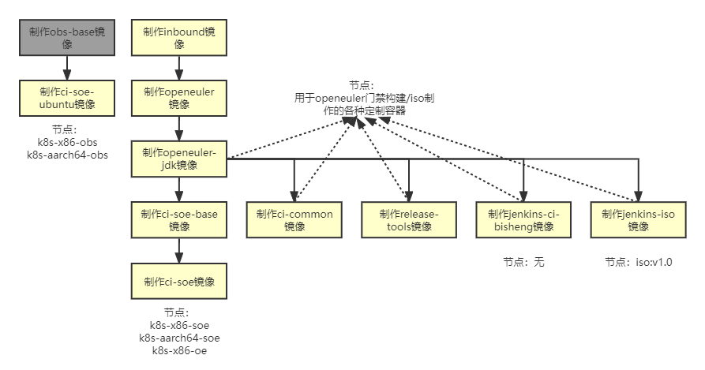

#  更新门禁环境节点镜像

# 一、背景

目前门禁代码机器环境已经放到了容器镜像中，因此每次更新门禁代码时均需要更新容器镜像代码才能生效，镜像版本通过tag区分。 

门禁代码上线流程依次包括3个步骤：向门禁代码仓提交并合入PR（找maintainer）；为此次提交生成tag（找maintainer）；更新容器镜像（找门禁看护人员）

# 二、jenkins_ci_soe任务

jenkins_ci_soe包含4个任务：

[_trigger](https://openeulerjenkins.osinfra.cn/job/multiarch/job/build-docker-image/job/jenkins-ci-soe/job/_trigger/)：参数化入口，用户选择包含要上线代码的tag号，点击build后会调用其2个下级任务。

[build-image-aarch64](https://openeulerjenkins.osinfra.cn/job/multiarch/job/build-docker-image/job/jenkins-ci-soe/job/build-image-aarch64/)：用来制作arrch64架构的docker镜像。

[build-image-x86-64](https://openeulerjenkins.osinfra.cn/job/multiarch/job/build-docker-image/job/jenkins-ci-soe/job/build-image-x86-64/)：用来制作x86-64架构的docker镜像。

[manifest](https://openeulerjenkins.osinfra.cn/job/multiarch/job/build-docker-image/job/jenkins-ci-soe/job/manifest/)：用来将最近生成的docker镜像进行拼接并推送到节点中。

## 1. 当前节点/镜像列表




下表列出了与门禁相关的节点：

| 节点                                                         | 工程                                   |
| ------------------------------------------------------------ | -------------------------------------- |
| k8s-x86-soe和k8s-aarch64-soe                                 | src-openeuler全部门禁工程              |
| k8s-x86-oe                                                   | openeuler中trigger和comment工程        |
| **k8s-x86-openeuler、k8s-x86-openeuler-20.03-lts、k8s-x86-openeuler-20.03-lts-sp1、k8s-x86-openeuler-20.03-lts-sp2、k8s-x86-openeuler-20.03-lts-sp3、k8s-x86-openeuler-20.09、k8s-x86-openeuler-21.03、k8s-aarch64-openeuler、k8s-aarch64-openeuler-20.03-lts、k8s-aarch64-openeuler-20.03-lts-sp1、k8s-aarch64-openeuler-20.03-lts-sp2、k8s-aarch64-openeuler-20.03-lts-sp3、k8s-aarch64-openeuler-20.09、k8s-aarch64-openeuler-21.03** | **openeuler中x86-64和aarch64构建工程** |

注：1. 当前src-openeuler全部门禁工程、openeuler中trigger和comment工程，全部代码有门禁侧统一配置，使用环境相同，因此节点固定

2.openeuler中x86-64和aarch64构建工程执行的代码是相关sig组自行管理的，使用的环境各不相同，节点可在**加粗部分**自由选择，请不要使用其他节点，以免干扰其他jenkins任务的功能


#  三、工程配置和调用方法

## 1. trigger

### 1.1 调用方法

工程链接https://openeulerjenkins.osinfra.cn/job/multiarch/job/build-docker-image/job/jenkins-ci-soe/job/_trigger/ ，点击构建时需要选择要打成镜像的tag版本号，此处绑定的是openeuler-jenkins代码的tag。

这个任务会调用build-image-aarch64和build-image-x86-64的执行。

### 1.2 trigger阶段工程配置

参数化构建：添加下拉框选择源码中的tag号。

源码管理：连接的是jenkins门禁代码：https://gitee.com/openeuler/openeuler-jenkins ，添加代码账号凭证获取代码。

build：build中没有什么实际操作

构建后操作：构建后启动build-image-x86-64,build-image-aarch64两个工程，预定义参数：name=ci/soe；tag=${tag}

后连接操作：在构建后操作的两个工程完成后会启动manifest工程，预定义参数：name=ci/soe；tag=${tag}

## 2. build-image

### build-image工程配置

以build-image-aarch64为例，工程链接为https://openeulerjenkins.osinfra.cn/job/multiarch/job/build-docker-image/job/jenkins-ci-soe/job/build-image-aarch64/

**定义参数：**

| 参数名 | 默认值  | 描述     | 来源        |
| ------ | ------- | -------- | ----------- |
| arch   | aarch64 | cpu框架  | 自定义      |
| name   | ci/soe  | 镜像名   | trigger传递 |
| tag    |         | 镜像版本 | trigger传递 |

从jenkins凭证中拿到：gitee的代码账号和密码；容器镜像仓库凭证。

**build构建：**

config_build_extra：构建额外需要的配置，比如maven、gradle、ccache。
config_dockerfile：配置dockerfile，设置yum源为华为云，安装门禁代码需要的一些其他的包和python的三方件等。

**Dockerfile命令：**

FROM： 就是指定 **基础镜像**

RUN： 指令是用来执行命令行命令的

ARG： 指令是定义参数名称，以及定义其默认值

## 3. manifest

### manifest工程配置

链接：https://openeulerjenkins.osinfra.cn/job/multiarch/job/build-docker-image/job/jenkins-ci-soe/job/manifest/

**定义参数**：

| 参数名       | 默认值  | 描述       | 来源        |
| ------------ | ------- | ---------- | ----------- |
| arch_x86     | x86-64  | amd64框架  | 自定义      |
| arch_aarch64 | aarch64 | arm/v8框架 | 自定义      |
| name         | ci/soe  | 镜像名     | trigger传递 |
| tag          |         | 镜像版本   | trigger传递 |

**biuld：**

```shell
#!/bin/bash

set +x 
# build image manifest for multi arch
echo ${name}---${tag}

name=${name}
version=${tag}	# 从环境变量中取 $(date +%Y%m%d)
image_latest=swr.cn-north-4.myhuaweicloud.com/openeuler/${name}:latest
image=swr.cn-north-4.myhuaweicloud.com/openeuler/${name}:${tag}
image_x86_64=swr.cn-north-4.myhuaweicloud.com/openeuler/${arch_x86}/${name}:${tag}
image_aarch64=swr.cn-north-4.myhuaweicloud.com/openeuler/${arch_aarch64}/${name}:${tag}

AreaProject="cn-north-4"

docker login -u ${DockerRegistryUserName} -p ${DockerRegistryPassword} swr.${AreaProject}.myhuaweicloud.com  &>/dev/null

# 编辑配置文件config.json应用实验性功能：docker 的默认配置文件config.json是在$HOME目录下的.docker目录下。编辑config.json文件，若目录和文件不存在手动创建
sed -i '$s/}/,"experimental":"enabled"}/' /home/jenkins/.docker/config.json

# 其中，${image}地址是manifest list地址，也就是最后统一了架构后的镜像地址；${image_x86_64} ${image_aarch64}则是已经在仓库中有的镜像地址
echo "create manifest"
docker manifest create --amend ${image} ${image_x86_64} ${image_aarch64} &>/dev/null
docker manifest create --amend ${image_latest} ${image_x86_64} ${image_aarch64} &>/dev/null

#给一个本地的镜像 manifest 添加额外的信息。创建多架构镜像的本地镜像后，可以选择对其进行注释。 允许的注释的内容包括体系结构和操作系统（如果已经有值，会覆盖镜像的当前值），操作系统功能以及体系结构变体。
#--arch	-	设置 CPU 架构信息
#--os	-	设置操作系统信息
echo "annotate manifest of arch ${arch_x86}"
docker manifest annotate ${image} ${image_x86_64} --os linux --arch amd64 &>/dev/null
docker manifest annotate ${image_latest} ${image_x86_64} --os linux --arch amd64 &>/dev/null

echo "annotate manifest of arch ${arch_aarch64}"
docker manifest annotate ${image} ${image_aarch64} --os linux --arch arm64 &>/dev/null
docker manifest annotate ${image_latest} ${image_aarch64} --os linux --arch arm64 &>/dev/null

#将这个manifest推到仓库中
echo "push manifest"
docker manifest push --purge ${image} &>/dev/null
docker manifest push --purge ${image_latest} &>/dev/null
echo "build image manifest for multi arch ... ok"

set -x
```

