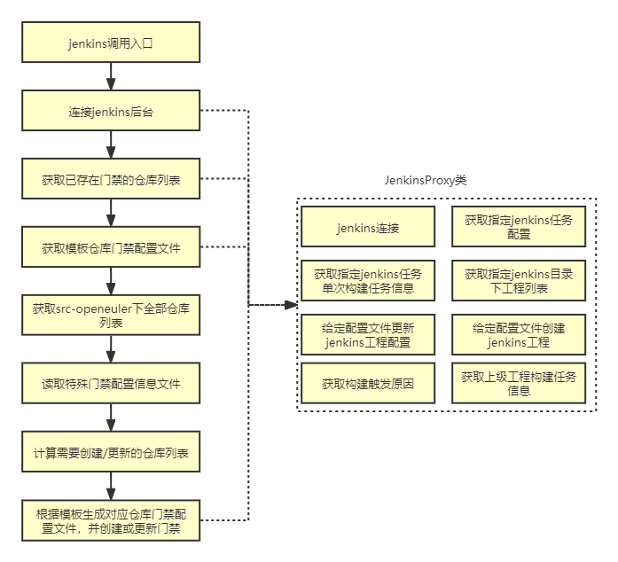

# 一、代码流程图

# 二、代码详细介绍

## 1. JenkinsProxy类

这个类封装了python-jenkins模块的功能，提供了连接、读取配置、更新配置、创建工程等jenkins后台操作。代码位于https://gitee.com/openeuler/openeuler-jenkins/blob/master/src/proxy/jenkins_proxy.py

| 方法                                 | 功能                                                         |
| ------------------------------------ | ------------------------------------------------------------ |
| __init__                             | 初始化，创建一个jenkins连接                                  |
| create_job                           | 创建jenkins工程                                              |
| update_job                           | 更新已有的jenkins工程配置                                    |
| get_config                           | 获取已有的jenkins工程配置                                    |
| get_jobs_list                        | 获取某路径下的jenkins工程列表                                |
| get_job_info                         | 获取某个jenkins工程的信息（包括历史构建链接，上下级工程信息） |
| get_build_info                       | 获取某个jenkins工程具体某一次构建的信息（包括构建结果、构建时间以及触发原因等） |
| get_build_trigger_reason             | 从get_build_info的结果中提取触发原因                         |
| get_job_path_from_job_url            | 从jenkins工程链接提取工程路径                                |
| get_job_path_build_no_from_build_url | 从jenkins构建链接提取工程路径和构建编号                      |
| _get_upstream_jobs_path              | 获取上级工程路径                                             |
| get_upstream_builds                  | 获取上级工程详细信息                                         |

## 2. SrcOpenEulerJenkinsJobs类

这个类提供了门禁自动化创建及批量更新的功能入口，结合JenkinsProxy类，提供了创建和更新过程相关的方法。代码位于https://gitee.com/openeuler/openeuler-jenkins/blob/master/src/jobs/jenkins_job.py

| 主要方法                  | 功能                                                         |
| ------------------------- | ------------------------------------------------------------ |
| init                      | 初始化，调用get_all_repos和load_exclusive_soe_config，并调用JenkinsProxy.get_config获取模板仓库门禁配置 |
| get_all_repos             | 从community仓库中获取src-openeuler仓库列表                   |
| load_exclusive_soe_config | 获取特殊门禁配置信息文件                                     |
| get_real_target_jobs      | 调用JenkinsProxy.get_jobs_list获取已存在的门禁仓库列表，然后结合社区仓库列表和指定参数计算实际需要操作的仓库列表 |
| update_config             | 对模板配置文件进行修改，生成目标仓库配置文件格式，可用于更新或创建 |

注：特殊门禁配置信息文件包含如下字段：

skipped_repo：表示不需要通用门禁的仓库，这里只有obs_meta

repo_config：涉及repo、buddy、package 3个key值，默认值其值都是仓库名，个别仓库有特殊配置（kata_container）

arch_config：仓库支持的构建架构，默认双架构，单架构或者多架构情况需要列出。

文件位于https://gitee.com/openeuler/openeuler-jenkins/blob/master/src/jobs/soe_exclusive_config.yaml