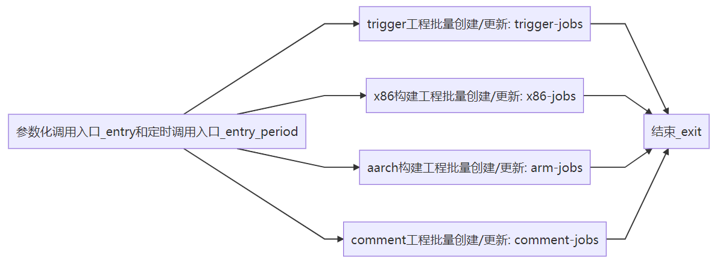
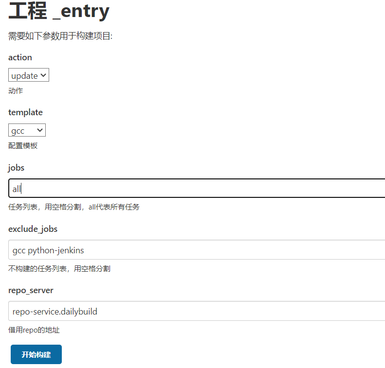
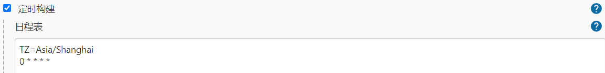

# 一、背景

由于社区仓库快速增加，手动一个一个配置门禁是比较繁琐的，因此需要一个脚本批量创建门禁工程。同时，由于门禁代码一直在演进，门禁配置也时常更新，每次更新则需要刷新数以万计的jenkins工程配置，无法手动实现，因此需要通过脚本实现配置更新。当前门禁工程批量自动化创建以及门禁配置批量更新已经实现，且可以通过jenkins任务（jobs-crud）调用，地址为https://jenkins.openeuler.org/job/multiarch/job/src-openeuler/job/jobs-crud/。

# 二、jobs-crud任务

jobs-crud包含7个任务：

entry：参数化入口，用户输入需要创建或者更新的门禁仓库列表，对每个仓库调用其4个下级任务对4中门禁jenkins工程进行创建或更新。

entry_period：自动化入口，自动拉取community/src-openeuler的仓库列表，与当前存在的门禁任务进行比对，对为创建门禁的仓库进行门禁创建；此任务为定时任务，间隔1小时。

trigger-jobs/x86-jobs/arm-jobs/comment-jobs：用于刷新指定仓库门禁的trigger/x86/aarch64/comment工程配置，特别的，这四个任务可以由entry和entry_period触发，也可单独参数化执行，参数跟entry一致。

exit：结束，无实际操作

| 参数                           | 描述                                         | 所在工程                                                     |
| ------------------------------ | -------------------------------------------- | ------------------------------------------------------------ |
| action                         | create/update，创建或更新工程                | entry/entry_period、trigger-jobs/x86-jobs/arm-jobs/comment-jobs |
| template                       | 模板仓库名                                   | entry/entry_period、trigger-jobs/x86-jobs/arm-jobs/comment-jobs |
| jobs                           | 目标仓库列表, all代表src-openeuler下所有仓库 | entry/entry_period、trigger-jobs/x86-jobs/arm-jobs/comment-jobs |
| exclude_jobs                   | 不执行action的仓库                           | entry/entry_period、trigger-jobs/x86-jobs/arm-jobs/comment-jobs |
| template_jobs_dir              | 模板仓库所在jenkins文件夹                    | trigger-jobs/x86-jobs/arm-jobs/comment-jobs                  |
| target_jobs_dir                | 目标仓库所在jenkins文件夹                    | trigger-jobs/x86-jobs/arm-jobs/comment-jobs                  |
| jenkins_user/jenkins_api_token | jenkins账号和token                           | trigger-jobs/x86-jobs/arm-jobs/comment-jobs                  |
| jenkins_baseurl                | jenkins地址                                  | trigger-jobs/x86-jobs/arm-jobs/comment-jobs                  |
| jenkins_timeout                | 请求jenkins server超时时间                   | trigger-jobs/x86-jobs/arm-jobs/comment-jobs                  |
| concurrency                    | 请求jenkins server的并发量                   | trigger-jobs/x86-jobs/arm-jobs/comment-jobs                  |

注：（1）entry_period是定时工程，当前每小时触发一次，只用于创建新门禁，action为create，template为gcc，jobs为all，exclude_jobs为空。

（2）假设A为社区src-openeuler下全部仓库（不包括obs_meta），B为jenkins已存在门禁的仓库。那么实际要更新或者修改的仓库列表：

| jobs是否包含all | action | 实际要创建或更新的门禁仓库列表    |
| --------------- | ------ | --------------------------------- |
| 是              | 创建   | *((A - B) ∩ jobs) - exclude_jobs* |
| 是              | 更新   | *(A ∩ B ∩ jobs) - exclude_jobs*   |
| 否              | 创建   | *(jobs - B) - exclude_jobs*       |
| 否              | 更新   | *(jobs ∩ B) - exclude_jobs*       |

# 三、调用方法

## 1 entry

工程链接https://jenkins.openeuler.org/job/multiarch/job/src-openeuler/job/jobs-crud/job/_entry

这个任务会调用trigger-jobs/x86-jobs/arm-jobs/comment-jobs这4个任务的执行。

## 2. entry_period

与entry参数相同，但这个任务参数是固定的，action为create，template为gcc，jobs为all，exclude_jobs为空，并且这个任务是定时的，每小时触发一次，目的是定时为社区新增的仓库创建门禁。

## 3. trigger-jobs/x86-jobs/arm-jobs/comment-jobs

可由entry或entry_period触发，其参数由entry或entry_period传入；可也直接调用，那么其参数自由设定。