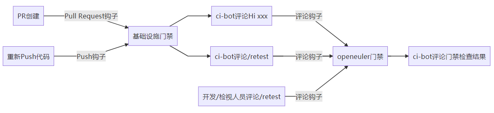
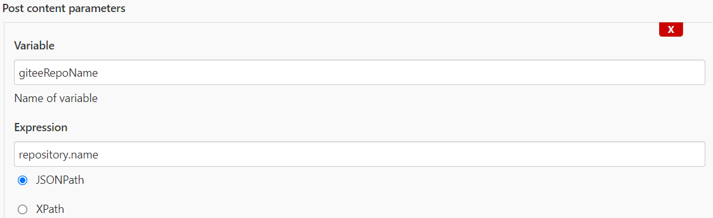

# 一、门禁触发流程

gitee提供了webhook功能，可以将代码提交信息发送给指定的url，openeuler和src-openeuler所有仓统一配置的是jenkins的地址。当前gitee webhook支持Push、Tag Push、Issue、Pull Request、评论（issue评论或PR评论） 5种触发方式。除community、obs-meta和release-manager外，openeuler和src-openeuler下其他仓库均是采用评论触发的方式，检测"Hi"以及“/retest”。



官方webhook说明文档https://gitee.com/help/articles/4186

# 二、 门禁获取webhook参数

门禁可以接收来自webhook的参数，webhook内容为json字典格式（详情可见附录->PR评论钩子）。门禁如果希望使用webhook中的参数，需要先定义一个变量(Variable)，其值为一个表达式（Expression），并选择JSONPath，比如例子中repository.name表示需要获取的字段在字典中第二层，即先获取键值repository对应的值，再从其结果中读取键值name的对应的值。



门禁涉及的webhook参数如下：

| Variable             | Expression                       | 描述                                             |
| -------------------- | -------------------------------- | ------------------------------------------------ |
| giteeRepoName        | repository.name                  | gitee仓库名                                      |
| giteePullRequestIid  | pull_request.number              | PR号                                             |
| giteeSourceBranch    | pull_request.head.ref            | PR源代码分支                                     |
| giteeTargetBranch    | pull_request.base.ref            | PR目标代码分支                                   |
| giteeSourceNamespace | pull_request.head.repo.namespace | PR源命名空间（openeuler/src-openeuler/用户名）   |
| giteeTargetNamespace | pull_request.base.repo.namespace | PR目标命名空间（openeuler/src-openeuler/用户名） |
| giteeCommitter       | pull_request.user.login          | PR提交人                                         |
| comment              | comment.body                     | 评论内容                                         |
| commentID            | comment.id                       | 评论id                                           |
| jobTriggerTime       | comment.updated_at               | 门禁触发时间                                     |
| prCreateTime         | pull_request.created_at          | PR创建时间                                       |
| triggerLink          | comment.html_url                 | 触发门禁的评论url                                |


# 附录

## 1. Push钩子

```
{
  "after": "6be41fa0d789789e9a7bd40c3854f40ad2227fe5",
  "before": "49c1eda2f38a5f4de93bdee42db2ca471c94f20e",
  "commits": [
    {
      "added": [

      ],
      "author": {
        "email": "zhengyaohui1@huawei.com",
        "id": 9498888,
        "name": "zhengyaohui",
        "remark": null,
        "time": "2022-01-29T09:26:13+00:00",
        "url": "https://gitee.com/zhengyaohui",
        "user": null,
        "user_name": "zhengyaohui",
        "username": "zhengyaohui"
      },
      "committer": {
        "email": "noreply@gitee.com",
        "id": 10186697,
        "name": "Gitee GPG Bot",
        "remark": null,
        "time": null,
        "url": "https://gitee.com/gitee-bot",
        "user": null,
        "user_name": "gitee-bot",
        "username": "gitee-bot"
      },
      "distinct": true,
      "id": "6be41fa0d789789e9a7bd40c3854f40ad2227fe5",
      "message": "update grpc.spec.\n",
      "modified": [
        "grpc.spec"
      ],
      "parent_ids": [
        "49c1eda2f38a5f4de93bdee42db2ca471c94f20e"
      ],
      "removed": [

      ],
      "timestamp": "2022-01-29T09:26:13+00:00",
      "tree_id": "7afd8231a80f05583a9d9726b0be8382124e9335",
      "url": "https://gitee.com/zhengyaohui/grpc/commit/6be41fa0d789789e9a7bd40c3854f40ad2227fe5"
    }
  ],
  "commits_more_than_ten": false,
  "compare": "https://gitee.com/zhengyaohui/grpc/compare/49c1eda2f38a5f4de93bdee42db2ca471c94f20e...6be41fa0d789789e9a7bd40c3854f40ad2227fe5",
  "created": false,
  "deleted": false,
  "enterprise": null,
  "head_commit": {
    "added": [

    ],
    "author": {
      "email": "zhengyaohui1@huawei.com",
      "id": 9498888,
      "name": "zhengyaohui",
      "remark": null,
      "time": "2022-01-29T09:26:13+00:00",
      "url": "https://gitee.com/zhengyaohui",
      "user": null,
      "user_name": "zhengyaohui",
      "username": "zhengyaohui"
    },
    "committer": {
      "email": "noreply@gitee.com",
      "id": 10186697,
      "name": "Gitee GPG Bot",
      "remark": null,
      "time": null,
      "url": "https://gitee.com/gitee-bot",
      "user": null,
      "user_name": "gitee-bot",
      "username": "gitee-bot"
    },
    "distinct": true,
    "id": "6be41fa0d789789e9a7bd40c3854f40ad2227fe5",
    "message": "update grpc.spec.\n",
    "modified": [
      "grpc.spec"
    ],
    "parent_ids": [
      "49c1eda2f38a5f4de93bdee42db2ca471c94f20e"
    ],
    "removed": [

    ],
    "timestamp": "2022-01-29T09:26:13+00:00",
    "tree_id": "7afd8231a80f05583a9d9726b0be8382124e9335",
    "url": "https://gitee.com/zhengyaohui/grpc/commit/6be41fa0d789789e9a7bd40c3854f40ad2227fe5"
  },
  "hook_id": 813284,
  "hook_name": "push_hooks",
  "hook_url": "https://gitee.com/zhengyaohui/grpc/hooks/813284/edit",
  "password": "",
  "project": {
    "clone_url": "https://gitee.com/zhengyaohui/grpc.git",
    "created_at": "2021-11-06T16:09:22+08:00",
    "default_branch": "master",
    "description": "",
    "fork": true,
    "forks_count": 15,
    "full_name": "zhengyaohui/grpc",
    "git_http_url": "https://gitee.com/zhengyaohui/grpc.git",
    "git_ssh_url": "git@gitee.com:zhengyaohui/grpc.git",
    "git_svn_url": "svn://gitee.com/zhengyaohui/grpc",
    "git_url": "git://gitee.com/zhengyaohui/grpc.git",
    "has_issues": true,
    "has_pages": false,
    "has_wiki": true,
    "homepage": "",
    "html_url": "https://gitee.com/zhengyaohui/grpc",
    "id": 19074432,
    "language": null,
    "license": null,
    "name": "grpc",
    "name_with_namespace": "zhengyaohui/grpc",
    "namespace": "zhengyaohui",
    "open_issues_count": 0,
    "owner": {
      "avatar_url": "https://gitee.com/assets/no_portrait.png",
      "email": "zhengyaohui1@huawei.com",
      "html_url": "https://gitee.com/zhengyaohui",
      "id": 9498888,
      "login": "zhengyaohui",
      "name": "zhengyaohui",
      "remark": null,
      "site_admin": false,
      "type": "User",
      "url": "https://gitee.com/zhengyaohui",
      "user_name": "zhengyaohui",
      "username": "zhengyaohui"
    },
    "path": "grpc",
    "path_with_namespace": "zhengyaohui/grpc",
    "private": false,
    "pushed_at": "2022-01-29T17:26:14+08:00",
    "ssh_url": "git@gitee.com:zhengyaohui/grpc.git",
    "stargazers_count": 0,
    "svn_url": "svn://gitee.com/zhengyaohui/grpc",
    "updated_at": "2022-01-29T17:26:14+08:00",
    "url": "https://gitee.com/zhengyaohui/grpc",
    "watchers_count": 1
  },
  "push_data": null,
  "pusher": {
    "email": "zhengyaohui1@huawei.com",
    "id": 9498888,
    "name": "zhengyaohui",
    "url": "https://gitee.com/zhengyaohui",
    "user_name": "zhengyaohui",
    "username": "zhengyaohui"
  },
  "ref": "refs/heads/openEuler-22.03-LTS-test",
  "repository": {
    "clone_url": "https://gitee.com/zhengyaohui/grpc.git",
    "created_at": "2021-11-06T16:09:22+08:00",
    "default_branch": "master",
    "description": "",
    "fork": true,
    "forks_count": 15,
    "full_name": "zhengyaohui/grpc",
    "git_http_url": "https://gitee.com/zhengyaohui/grpc.git",
    "git_ssh_url": "git@gitee.com:zhengyaohui/grpc.git",
    "git_svn_url": "svn://gitee.com/zhengyaohui/grpc",
    "git_url": "git://gitee.com/zhengyaohui/grpc.git",
    "has_issues": true,
    "has_pages": false,
    "has_wiki": true,
    "homepage": "",
    "html_url": "https://gitee.com/zhengyaohui/grpc",
    "id": 19074432,
    "language": null,
    "license": null,
    "name": "grpc",
    "name_with_namespace": "zhengyaohui/grpc",
    "namespace": "zhengyaohui",
    "open_issues_count": 0,
    "owner": {
      "avatar_url": "https://gitee.com/assets/no_portrait.png",
      "email": "zhengyaohui1@huawei.com",
      "html_url": "https://gitee.com/zhengyaohui",
      "id": 9498888,
      "login": "zhengyaohui",
      "name": "zhengyaohui",
      "remark": null,
      "site_admin": false,
      "type": "User",
      "url": "https://gitee.com/zhengyaohui",
      "user_name": "zhengyaohui",
      "username": "zhengyaohui"
    },
    "path": "grpc",
    "path_with_namespace": "zhengyaohui/grpc",
    "private": false,
    "pushed_at": "2022-01-29T17:26:14+08:00",
    "ssh_url": "git@gitee.com:zhengyaohui/grpc.git",
    "stargazers_count": 0,
    "svn_url": "svn://gitee.com/zhengyaohui/grpc",
    "updated_at": "2022-01-29T17:26:14+08:00",
    "url": "https://gitee.com/zhengyaohui/grpc",
    "watchers_count": 1
  },
  "sender": {
    "avatar_url": "https://gitee.com/assets/no_portrait.png",
    "email": "zhengyaohui1@huawei.com",
    "html_url": "https://gitee.com/zhengyaohui",
    "id": 9498888,
    "login": "zhengyaohui",
    "name": "zhengyaohui",
    "remark": null,
    "site_admin": false,
    "type": "User",
    "url": "https://gitee.com/zhengyaohui",
    "user_name": "zhengyaohui",
    "username": "zhengyaohui"
  },
  "sign": "",
  "timestamp": "1643448374411",
  "total_commits_count": 1,
  "user": {
    "email": "zhengyaohui1@huawei.com",
    "id": 9498888,
    "name": "zhengyaohui",
    "url": "https://gitee.com/zhengyaohui",
    "user_name": "zhengyaohui",
    "username": "zhengyaohui"
  },
  "user_id": 9498888,
  "user_name": "zhengyaohui"
}
```

## 2. Push Tag钩子

新建tag："hook_name": "tag_push_hooks"; "created": true; "deleted": false; "ref": "refs/tags/tag名字"

删除tag："hook_name": "tag_push_hooks"; "created": true; "deleted": false; "ref": "refs/tags/tag名字"

```
{
  "after": "0d87d2a9276be5bdfbd368f128c56498f9387068",
  "before": "0000000000000000000000000000000000000000",
  "commits": null,
  "commits_more_than_ten": null,
  "compare": "https://gitee.com/zhengyaohui/grpc/compare/0000000000000000000000000000000000000000...0d87d2a9276be5bdfbd368f128c56498f9387068",
  "created": true,
  "deleted": false,
  "enterprise": null,
  "head_commit": {
    "added": [
      "backport-grpc-1.41.1-python-grpcio-use-system-abseil.patch",
      "grpc-1.41.1.tar.gz"
    ],
    "author": {
      "email": "zhengyaohui1@huawei.com",
      "id": 9498888,
      "name": "zhengyaohui",
      "remark": null,
      "time": "2022-02-17T09:45:03+00:00",
      "url": "https://gitee.com/zhengyaohui",
      "user": null,
      "user_name": "zhengyaohui",
      "username": "zhengyaohui"
    },
    "committer": {
      "email": "noreply@gitee.com",
      "id": 10186697,
      "name": "Gitee GPG Bot",
      "remark": null,
      "time": null,
      "url": "https://gitee.com/gitee-bot",
      "user": null,
      "user_name": "gitee-bot",
      "username": "gitee-bot"
    },
    "distinct": true,
    "id": "0d87d2a9276be5bdfbd368f128c56498f9387068",
    "message": "!20 xxx\nMerge pull request !20 from zhengyaohui/openEuler-22.03-LTS-test",
    "modified": [
      "grpc.spec"
    ],
    "parent_ids": [
      "611bd30696a0f9895dcfd15aac5592445832606f",
      "6be41fa0d789789e9a7bd40c3854f40ad2227fe5"
    ],
    "removed": [
      "Add-ABSL_RANDOM_HWAES_FLAGS.patch",
      "Copy-channel-args-hash-before-appending-ruby-user-ag.patch",
      "Fix-destruction-race-between-subchannel-and-client_c.patch",
      "Fix-use-after-free-by-removing-stream-from-transport.patch",
      "Ran-generate_proto_ruby.sh-to-update-generated-files.patch",
      "allow-grpcio-to-be-build-against-system-re2.patch",
      "grpc-1.31.0-python-grpcio-use-system-abseil.patch",
      "fix-re2-build-error.patch",
      "grpc-1.31.0.tar.gz",
      "repair-gflags-compile-error-with-cmake.patch"
    ],
    "timestamp": "2022-02-17T09:45:03+00:00",
    "tree_id": "7afd8231a80f05583a9d9726b0be8382124e9335",
    "url": "https://gitee.com/zhengyaohui/grpc/commit/0d87d2a9276be5bdfbd368f128c56498f9387068"
  },
  "hook_id": 813284,
  "hook_name": "tag_push_hooks",
  "hook_url": "https://gitee.com/zhengyaohui/grpc/hooks/813284/edit",
  "password": "",
  "project": {
    "clone_url": "https://gitee.com/zhengyaohui/grpc.git",
    "created_at": "2021-11-06T16:09:22+08:00",
    "default_branch": "master",
    "description": "",
    "fork": true,
    "forks_count": 15,
    "full_name": "zhengyaohui/grpc",
    "git_http_url": "https://gitee.com/zhengyaohui/grpc.git",
    "git_ssh_url": "git@gitee.com:zhengyaohui/grpc.git",
    "git_svn_url": "svn://gitee.com/zhengyaohui/grpc",
    "git_url": "git://gitee.com/zhengyaohui/grpc.git",
    "has_issues": true,
    "has_pages": false,
    "has_wiki": true,
    "homepage": "",
    "html_url": "https://gitee.com/zhengyaohui/grpc",
    "id": 19074432,
    "language": null,
    "license": null,
    "name": "grpc",
    "name_with_namespace": "zhengyaohui/grpc",
    "namespace": "zhengyaohui",
    "open_issues_count": 0,
    "owner": {
      "avatar_url": "https://gitee.com/assets/no_portrait.png",
      "email": "zhengyaohui1@huawei.com",
      "html_url": "https://gitee.com/zhengyaohui",
      "id": 9498888,
      "login": "zhengyaohui",
      "name": "zhengyaohui",
      "remark": null,
      "site_admin": false,
      "type": "User",
      "url": "https://gitee.com/zhengyaohui",
      "user_name": "zhengyaohui",
      "username": "zhengyaohui"
    },
    "path": "grpc",
    "path_with_namespace": "zhengyaohui/grpc",
    "private": false,
    "pushed_at": "2022-02-17T18:20:36+08:00",
    "ssh_url": "git@gitee.com:zhengyaohui/grpc.git",
    "stargazers_count": 0,
    "svn_url": "svn://gitee.com/zhengyaohui/grpc",
    "updated_at": "2022-02-17T18:20:37+08:00",
    "url": "https://gitee.com/zhengyaohui/grpc",
    "watchers_count": 1
  },
  "push_data": null,
  "pusher": {
    "email": "zhengyaohui1@huawei.com",
    "id": 9498888,
    "name": "zhengyaohui",
    "url": "https://gitee.com/zhengyaohui",
    "user_name": "zhengyaohui",
    "username": "zhengyaohui"
  },
  "ref": "refs/tags/vtest.0.0.0",
  "repository": {
    "clone_url": "https://gitee.com/zhengyaohui/grpc.git",
    "created_at": "2021-11-06T16:09:22+08:00",
    "default_branch": "master",
    "description": "",
    "fork": true,
    "forks_count": 15,
    "full_name": "zhengyaohui/grpc",
    "git_http_url": "https://gitee.com/zhengyaohui/grpc.git",
    "git_ssh_url": "git@gitee.com:zhengyaohui/grpc.git",
    "git_svn_url": "svn://gitee.com/zhengyaohui/grpc",
    "git_url": "git://gitee.com/zhengyaohui/grpc.git",
    "has_issues": true,
    "has_pages": false,
    "has_wiki": true,
    "homepage": "",
    "html_url": "https://gitee.com/zhengyaohui/grpc",
    "id": 19074432,
    "language": null,
    "license": null,
    "name": "grpc",
    "name_with_namespace": "zhengyaohui/grpc",
    "namespace": "zhengyaohui",
    "open_issues_count": 0,
    "owner": {
      "avatar_url": "https://gitee.com/assets/no_portrait.png",
      "email": "zhengyaohui1@huawei.com",
      "html_url": "https://gitee.com/zhengyaohui",
      "id": 9498888,
      "login": "zhengyaohui",
      "name": "zhengyaohui",
      "remark": null,
      "site_admin": false,
      "type": "User",
      "url": "https://gitee.com/zhengyaohui",
      "user_name": "zhengyaohui",
      "username": "zhengyaohui"
    },
    "path": "grpc",
    "path_with_namespace": "zhengyaohui/grpc",
    "private": false,
    "pushed_at": "2022-02-17T18:20:36+08:00",
    "ssh_url": "git@gitee.com:zhengyaohui/grpc.git",
    "stargazers_count": 0,
    "svn_url": "svn://gitee.com/zhengyaohui/grpc",
    "updated_at": "2022-02-17T18:20:37+08:00",
    "url": "https://gitee.com/zhengyaohui/grpc",
    "watchers_count": 1
  },
  "sender": {
    "avatar_url": "https://gitee.com/assets/no_portrait.png",
    "email": "zhengyaohui1@huawei.com",
    "html_url": "https://gitee.com/zhengyaohui",
    "id": 9498888,
    "login": "zhengyaohui",
    "name": "zhengyaohui",
    "remark": null,
    "site_admin": false,
    "type": "User",
    "url": "https://gitee.com/zhengyaohui",
    "user_name": "zhengyaohui",
    "username": "zhengyaohui"
  },
  "sign": "",
  "timestamp": "1645093237628",
  "total_commits_count": null,
  "user": {
    "email": "zhengyaohui1@huawei.com",
    "id": 9498888,
    "name": "zhengyaohui",
    "url": "https://gitee.com/zhengyaohui",
    "user_name": "zhengyaohui",
    "username": "zhengyaohui"
  },
  "user_id": 9498888,
  "user_name": "zhengyaohui"
}
```


## 3. Pull Request钩子

PR创建："action": “open”;  "merged": false; "state": "open"

PR修改："action": "assign";  "merged": false; "state": "open"

PR合并："action": "merge";  "merged": true; "state": "merged"

PR关闭："action": "close";  "merged": false; "state": "closed"

以下为PR创建例子：

```
{
  "action": "open",
  "action_desc": "open",
  "author": {
    "avatar_url": "https://gitee.com/assets/no_portrait.png",
    "email": "zhengyaohui1@huawei.com",
    "html_url": "https://gitee.com/zhengyaohui",
    "id": 9498888,
    "login": "zhengyaohui",
    "name": "zhengyaohui",
    "remark": null,
    "site_admin": false,
    "type": "User",
    "url": "https://gitee.com/zhengyaohui",
    "user_name": "zhengyaohui",
    "username": "zhengyaohui"
  },
  "body": "",
  "enterprise": null,
  "hook_id": 813284,
  "hook_name": "merge_request_hooks",
  "hook_url": "https://gitee.com/zhengyaohui/grpc/hooks/813284/edit",
  "iid": 20,
  "languages": [

  ],
  "merge_commit_sha": "24e85382c6fbfa647123fac23746315c7643a6bc",
  "merge_status": "can_be_merged",
  "number": 20,
  "password": "",
  "project": {
    "clone_url": "https://gitee.com/zhengyaohui/grpc.git",
    "created_at": "2021-11-06T16:09:22+08:00",
    "default_branch": "master",
    "description": "",
    "fork": true,
    "forks_count": 15,
    "full_name": "zhengyaohui/grpc",
    "git_http_url": "https://gitee.com/zhengyaohui/grpc.git",
    "git_ssh_url": "git@gitee.com:zhengyaohui/grpc.git",
    "git_svn_url": "svn://gitee.com/zhengyaohui/grpc",
    "git_url": "git://gitee.com/zhengyaohui/grpc.git",
    "has_issues": true,
    "has_pages": false,
    "has_wiki": true,
    "homepage": "",
    "html_url": "https://gitee.com/zhengyaohui/grpc",
    "id": 19074432,
    "language": null,
    "license": null,
    "name": "grpc",
    "name_with_namespace": "zhengyaohui/grpc",
    "namespace": "zhengyaohui",
    "open_issues_count": 0,
    "owner": {
      "avatar_url": "https://gitee.com/assets/no_portrait.png",
      "email": "zhengyaohui1@huawei.com",
      "html_url": "https://gitee.com/zhengyaohui",
      "id": 9498888,
      "login": "zhengyaohui",
      "name": "zhengyaohui",
      "remark": null,
      "site_admin": false,
      "type": "User",
      "url": "https://gitee.com/zhengyaohui",
      "user_name": "zhengyaohui",
      "username": "zhengyaohui"
    },
    "path": "grpc",
    "path_with_namespace": "zhengyaohui/grpc",
    "private": false,
    "pushed_at": "2022-01-29T17:26:14+08:00",
    "ssh_url": "git@gitee.com:zhengyaohui/grpc.git",
    "stargazers_count": 0,
    "svn_url": "svn://gitee.com/zhengyaohui/grpc",
    "updated_at": "2022-02-17T17:39:16+08:00",
    "url": "https://gitee.com/zhengyaohui/grpc",
    "watchers_count": 1
  },
  "pull_request": {
    "additions": 64,
    "assignee": null,
    "assignees": [
      {
        "avatar_url": "https://gitee.com/assets/no_portrait.png",
        "email": "zhengyaohui1@huawei.com",
        "html_url": "https://gitee.com/zhengyaohui",
        "id": 9498888,
        "login": "zhengyaohui",
        "name": "zhengyaohui",
        "remark": null,
        "site_admin": false,
        "type": "User",
        "url": "https://gitee.com/zhengyaohui",
        "user_name": "zhengyaohui",
        "username": "zhengyaohui"
      }
    ],
    "base": {
      "label": "zhengyaohui:master",
      "ref": "master",
      "repo": {
        "clone_url": "https://gitee.com/zhengyaohui/grpc.git",
        "created_at": "2021-11-06T16:09:22+08:00",
        "default_branch": "master",
        "description": "",
        "fork": true,
        "forks_count": 15,
        "full_name": "zhengyaohui/grpc",
        "git_http_url": "https://gitee.com/zhengyaohui/grpc.git",
        "git_ssh_url": "git@gitee.com:zhengyaohui/grpc.git",
        "git_svn_url": "svn://gitee.com/zhengyaohui/grpc",
        "git_url": "git://gitee.com/zhengyaohui/grpc.git",
        "has_issues": true,
        "has_pages": false,
        "has_wiki": true,
        "homepage": "",
        "html_url": "https://gitee.com/zhengyaohui/grpc",
        "id": 19074432,
        "language": null,
        "license": null,
        "name": "grpc",
        "name_with_namespace": "zhengyaohui/grpc",
        "namespace": "zhengyaohui",
        "open_issues_count": 0,
        "owner": {
          "avatar_url": "https://gitee.com/assets/no_portrait.png",
          "email": "zhengyaohui1@huawei.com",
          "html_url": "https://gitee.com/zhengyaohui",
          "id": 9498888,
          "login": "zhengyaohui",
          "name": "zhengyaohui",
          "remark": null,
          "site_admin": false,
          "type": "User",
          "url": "https://gitee.com/zhengyaohui",
          "user_name": "zhengyaohui",
          "username": "zhengyaohui"
        },
        "path": "grpc",
        "path_with_namespace": "zhengyaohui/grpc",
        "private": false,
        "pushed_at": "2022-01-29T17:26:14+08:00",
        "ssh_url": "git@gitee.com:zhengyaohui/grpc.git",
        "stargazers_count": 0,
        "svn_url": "svn://gitee.com/zhengyaohui/grpc",
        "updated_at": "2022-02-17T17:39:16+08:00",
        "url": "https://gitee.com/zhengyaohui/grpc",
        "watchers_count": 1
      },
      "sha": "611bd30696a0f9895dcfd15aac5592445832606f",
      "user": {
        "avatar_url": "https://gitee.com/assets/no_portrait.png",
        "email": "zhengyaohui1@huawei.com",
        "html_url": "https://gitee.com/zhengyaohui",
        "id": 9498888,
        "login": "zhengyaohui",
        "name": "zhengyaohui",
        "remark": null,
        "site_admin": false,
        "type": "User",
        "url": "https://gitee.com/zhengyaohui",
        "user_name": "zhengyaohui",
        "username": "zhengyaohui"
      }
    },
    "body": "",
    "changed_files": 11,
    "closed_at": null,
    "comments": 0,
    "commits": 3,
    "created_at": "2022-02-17T17:39:15+08:00",
    "deletions": 775,
    "diff_url": "https://gitee.com/zhengyaohui/grpc/pulls/20.diff",
    "head": {
      "label": "zhengyaohui:openEuler-22.03-LTS-test",
      "ref": "openEuler-22.03-LTS-test",
      "repo": {
        "clone_url": "https://gitee.com/zhengyaohui/grpc.git",
        "created_at": "2021-11-06T16:09:22+08:00",
        "default_branch": "master",
        "description": "",
        "fork": true,
        "forks_count": 15,
        "full_name": "zhengyaohui/grpc",
        "git_http_url": "https://gitee.com/zhengyaohui/grpc.git",
        "git_ssh_url": "git@gitee.com:zhengyaohui/grpc.git",
        "git_svn_url": "svn://gitee.com/zhengyaohui/grpc",
        "git_url": "git://gitee.com/zhengyaohui/grpc.git",
        "has_issues": true,
        "has_pages": false,
        "has_wiki": true,
        "homepage": "",
        "html_url": "https://gitee.com/zhengyaohui/grpc",
        "id": 19074432,
        "language": null,
        "license": null,
        "name": "grpc",
        "name_with_namespace": "zhengyaohui/grpc",
        "namespace": "zhengyaohui",
        "open_issues_count": 0,
        "owner": {
          "avatar_url": "https://gitee.com/assets/no_portrait.png",
          "email": "zhengyaohui1@huawei.com",
          "html_url": "https://gitee.com/zhengyaohui",
          "id": 9498888,
          "login": "zhengyaohui",
          "name": "zhengyaohui",
          "remark": null,
          "site_admin": false,
          "type": "User",
          "url": "https://gitee.com/zhengyaohui",
          "user_name": "zhengyaohui",
          "username": "zhengyaohui"
        },
        "path": "grpc",
        "path_with_namespace": "zhengyaohui/grpc",
        "private": false,
        "pushed_at": "2022-01-29T17:26:14+08:00",
        "ssh_url": "git@gitee.com:zhengyaohui/grpc.git",
        "stargazers_count": 0,
        "svn_url": "svn://gitee.com/zhengyaohui/grpc",
        "updated_at": "2022-02-17T17:39:16+08:00",
        "url": "https://gitee.com/zhengyaohui/grpc",
        "watchers_count": 1
      },
      "sha": "6be41fa0d789789e9a7bd40c3854f40ad2227fe5",
      "user": {
        "avatar_url": "https://gitee.com/assets/no_portrait.png",
        "email": "zhengyaohui1@huawei.com",
        "html_url": "https://gitee.com/zhengyaohui",
        "id": 9498888,
        "login": "zhengyaohui",
        "name": "zhengyaohui",
        "remark": null,
        "site_admin": false,
        "type": "User",
        "url": "https://gitee.com/zhengyaohui",
        "user_name": "zhengyaohui",
        "username": "zhengyaohui"
      }
    },
    "html_url": "https://gitee.com/zhengyaohui/grpc/pulls/20",
    "id": 5534705,
    "issues": [

    ],
    "labels": [

    ],
    "languages": [

    ],
    "merge_commit_sha": "24e85382c6fbfa647123fac23746315c7643a6bc",
    "merge_reference_name": "refs/pull/20/MERGE",
    "merge_status": "can_be_merged",
    "mergeable": true,
    "merged": false,
    "merged_at": null,
    "milestone": null,
    "need_review": true,
    "need_test": true,
    "number": 20,
    "patch_url": "https://gitee.com/zhengyaohui/grpc/pulls/20.patch",
    "stale_issues": [

    ],
    "stale_labels": [

    ],
    "state": "open",
    "tester": null,
    "testers": [
      {
        "avatar_url": "https://gitee.com/assets/no_portrait.png",
        "email": "zhengyaohui1@huawei.com",
        "html_url": "https://gitee.com/zhengyaohui",
        "id": 9498888,
        "login": "zhengyaohui",
        "name": "zhengyaohui",
        "remark": null,
        "site_admin": false,
        "type": "User",
        "url": "https://gitee.com/zhengyaohui",
        "user_name": "zhengyaohui",
        "username": "zhengyaohui"
      }
    ],
    "title": "xxx",
    "updated_at": "2022-02-17T17:39:19+08:00",
    "updated_by": {
      "avatar_url": "https://gitee.com/assets/no_portrait.png",
      "email": "zhengyaohui1@huawei.com",
      "html_url": "https://gitee.com/zhengyaohui",
      "id": 9498888,
      "login": "zhengyaohui",
      "name": "zhengyaohui",
      "remark": null,
      "site_admin": false,
      "type": "User",
      "url": "https://gitee.com/zhengyaohui",
      "user_name": "zhengyaohui",
      "username": "zhengyaohui"
    },
    "user": {
      "avatar_url": "https://gitee.com/assets/no_portrait.png",
      "email": "zhengyaohui1@huawei.com",
      "html_url": "https://gitee.com/zhengyaohui",
      "id": 9498888,
      "login": "zhengyaohui",
      "name": "zhengyaohui",
      "remark": null,
      "site_admin": false,
      "type": "User",
      "url": "https://gitee.com/zhengyaohui",
      "user_name": "zhengyaohui",
      "username": "zhengyaohui"
    }
  },
  "push_data": null,
  "repository": {
    "clone_url": "https://gitee.com/zhengyaohui/grpc.git",
    "created_at": "2021-11-06T16:09:22+08:00",
    "default_branch": "master",
    "description": "",
    "fork": true,
    "forks_count": 15,
    "full_name": "zhengyaohui/grpc",
    "git_http_url": "https://gitee.com/zhengyaohui/grpc.git",
    "git_ssh_url": "git@gitee.com:zhengyaohui/grpc.git",
    "git_svn_url": "svn://gitee.com/zhengyaohui/grpc",
    "git_url": "git://gitee.com/zhengyaohui/grpc.git",
    "has_issues": true,
    "has_pages": false,
    "has_wiki": true,
    "homepage": "",
    "html_url": "https://gitee.com/zhengyaohui/grpc",
    "id": 19074432,
    "language": null,
    "license": null,
    "name": "grpc",
    "name_with_namespace": "zhengyaohui/grpc",
    "namespace": "zhengyaohui",
    "open_issues_count": 0,
    "owner": {
      "avatar_url": "https://gitee.com/assets/no_portrait.png",
      "email": "zhengyaohui1@huawei.com",
      "html_url": "https://gitee.com/zhengyaohui",
      "id": 9498888,
      "login": "zhengyaohui",
      "name": "zhengyaohui",
      "remark": null,
      "site_admin": false,
      "type": "User",
      "url": "https://gitee.com/zhengyaohui",
      "user_name": "zhengyaohui",
      "username": "zhengyaohui"
    },
    "path": "grpc",
    "path_with_namespace": "zhengyaohui/grpc",
    "private": false,
    "pushed_at": "2022-01-29T17:26:14+08:00",
    "ssh_url": "git@gitee.com:zhengyaohui/grpc.git",
    "stargazers_count": 0,
    "svn_url": "svn://gitee.com/zhengyaohui/grpc",
    "updated_at": "2022-02-17T17:39:16+08:00",
    "url": "https://gitee.com/zhengyaohui/grpc",
    "watchers_count": 1
  },
  "sender": {
    "avatar_url": "https://gitee.com/assets/no_portrait.png",
    "email": "zhengyaohui1@huawei.com",
    "html_url": "https://gitee.com/zhengyaohui",
    "id": 9498888,
    "login": "zhengyaohui",
    "name": "zhengyaohui",
    "remark": null,
    "site_admin": false,
    "type": "User",
    "url": "https://gitee.com/zhengyaohui",
    "user_name": "zhengyaohui",
    "username": "zhengyaohui"
  },
  "sign": "",
  "source_branch": "openEuler-22.03-LTS-test",
  "source_repo": {
    "project": {
      "clone_url": "https://gitee.com/zhengyaohui/grpc.git",
      "created_at": "2021-11-06T16:09:22+08:00",
      "default_branch": "master",
      "description": "",
      "fork": true,
      "forks_count": 15,
      "full_name": "zhengyaohui/grpc",
      "git_http_url": "https://gitee.com/zhengyaohui/grpc.git",
      "git_ssh_url": "git@gitee.com:zhengyaohui/grpc.git",
      "git_svn_url": "svn://gitee.com/zhengyaohui/grpc",
      "git_url": "git://gitee.com/zhengyaohui/grpc.git",
      "has_issues": true,
      "has_pages": false,
      "has_wiki": true,
      "homepage": "",
      "html_url": "https://gitee.com/zhengyaohui/grpc",
      "id": 19074432,
      "language": null,
      "license": null,
      "name": "grpc",
      "name_with_namespace": "zhengyaohui/grpc",
      "namespace": "zhengyaohui",
      "open_issues_count": 0,
      "owner": {
        "avatar_url": "https://gitee.com/assets/no_portrait.png",
        "email": "zhengyaohui1@huawei.com",
        "html_url": "https://gitee.com/zhengyaohui",
        "id": 9498888,
        "login": "zhengyaohui",
        "name": "zhengyaohui",
        "remark": null,
        "site_admin": false,
        "type": "User",
        "url": "https://gitee.com/zhengyaohui",
        "user_name": "zhengyaohui",
        "username": "zhengyaohui"
      },
      "path": "grpc",
      "path_with_namespace": "zhengyaohui/grpc",
      "private": false,
      "pushed_at": "2022-01-29T17:26:14+08:00",
      "ssh_url": "git@gitee.com:zhengyaohui/grpc.git",
      "stargazers_count": 0,
      "svn_url": "svn://gitee.com/zhengyaohui/grpc",
      "updated_at": "2022-02-17T17:39:16+08:00",
      "url": "https://gitee.com/zhengyaohui/grpc",
      "watchers_count": 1
    },
    "repository": {
      "clone_url": "https://gitee.com/zhengyaohui/grpc.git",
      "created_at": "2021-11-06T16:09:22+08:00",
      "default_branch": "master",
      "description": "",
      "fork": true,
      "forks_count": 15,
      "full_name": "zhengyaohui/grpc",
      "git_http_url": "https://gitee.com/zhengyaohui/grpc.git",
      "git_ssh_url": "git@gitee.com:zhengyaohui/grpc.git",
      "git_svn_url": "svn://gitee.com/zhengyaohui/grpc",
      "git_url": "git://gitee.com/zhengyaohui/grpc.git",
      "has_issues": true,
      "has_pages": false,
      "has_wiki": true,
      "homepage": "",
      "html_url": "https://gitee.com/zhengyaohui/grpc",
      "id": 19074432,
      "language": null,
      "license": null,
      "name": "grpc",
      "name_with_namespace": "zhengyaohui/grpc",
      "namespace": "zhengyaohui",
      "open_issues_count": 0,
      "owner": {
        "avatar_url": "https://gitee.com/assets/no_portrait.png",
        "email": "zhengyaohui1@huawei.com",
        "html_url": "https://gitee.com/zhengyaohui",
        "id": 9498888,
        "login": "zhengyaohui",
        "name": "zhengyaohui",
        "remark": null,
        "site_admin": false,
        "type": "User",
        "url": "https://gitee.com/zhengyaohui",
        "user_name": "zhengyaohui",
        "username": "zhengyaohui"
      },
      "path": "grpc",
      "path_with_namespace": "zhengyaohui/grpc",
      "private": false,
      "pushed_at": "2022-01-29T17:26:14+08:00",
      "ssh_url": "git@gitee.com:zhengyaohui/grpc.git",
      "stargazers_count": 0,
      "svn_url": "svn://gitee.com/zhengyaohui/grpc",
      "updated_at": "2022-02-17T17:39:16+08:00",
      "url": "https://gitee.com/zhengyaohui/grpc",
      "watchers_count": 1
    }
  },
  "state": "open",
  "target_branch": "master",
  "target_repo": {
    "project": {
      "clone_url": "https://gitee.com/zhengyaohui/grpc.git",
      "created_at": "2021-11-06T16:09:22+08:00",
      "default_branch": "master",
      "description": "",
      "fork": true,
      "forks_count": 15,
      "full_name": "zhengyaohui/grpc",
      "git_http_url": "https://gitee.com/zhengyaohui/grpc.git",
      "git_ssh_url": "git@gitee.com:zhengyaohui/grpc.git",
      "git_svn_url": "svn://gitee.com/zhengyaohui/grpc",
      "git_url": "git://gitee.com/zhengyaohui/grpc.git",
      "has_issues": true,
      "has_pages": false,
      "has_wiki": true,
      "homepage": "",
      "html_url": "https://gitee.com/zhengyaohui/grpc",
      "id": 19074432,
      "language": null,
      "license": null,
      "name": "grpc",
      "name_with_namespace": "zhengyaohui/grpc",
      "namespace": "zhengyaohui",
      "open_issues_count": 0,
      "owner": {
        "avatar_url": "https://gitee.com/assets/no_portrait.png",
        "email": "zhengyaohui1@huawei.com",
        "html_url": "https://gitee.com/zhengyaohui",
        "id": 9498888,
        "login": "zhengyaohui",
        "name": "zhengyaohui",
        "remark": null,
        "site_admin": false,
        "type": "User",
        "url": "https://gitee.com/zhengyaohui",
        "user_name": "zhengyaohui",
        "username": "zhengyaohui"
      },
      "path": "grpc",
      "path_with_namespace": "zhengyaohui/grpc",
      "private": false,
      "pushed_at": "2022-01-29T17:26:14+08:00",
      "ssh_url": "git@gitee.com:zhengyaohui/grpc.git",
      "stargazers_count": 0,
      "svn_url": "svn://gitee.com/zhengyaohui/grpc",
      "updated_at": "2022-02-17T17:39:16+08:00",
      "url": "https://gitee.com/zhengyaohui/grpc",
      "watchers_count": 1
    },
    "repository": {
      "clone_url": "https://gitee.com/zhengyaohui/grpc.git",
      "created_at": "2021-11-06T16:09:22+08:00",
      "default_branch": "master",
      "description": "",
      "fork": true,
      "forks_count": 15,
      "full_name": "zhengyaohui/grpc",
      "git_http_url": "https://gitee.com/zhengyaohui/grpc.git",
      "git_ssh_url": "git@gitee.com:zhengyaohui/grpc.git",
      "git_svn_url": "svn://gitee.com/zhengyaohui/grpc",
      "git_url": "git://gitee.com/zhengyaohui/grpc.git",
      "has_issues": true,
      "has_pages": false,
      "has_wiki": true,
      "homepage": "",
      "html_url": "https://gitee.com/zhengyaohui/grpc",
      "id": 19074432,
      "language": null,
      "license": null,
      "name": "grpc",
      "name_with_namespace": "zhengyaohui/grpc",
      "namespace": "zhengyaohui",
      "open_issues_count": 0,
      "owner": {
        "avatar_url": "https://gitee.com/assets/no_portrait.png",
        "email": "zhengyaohui1@huawei.com",
        "html_url": "https://gitee.com/zhengyaohui",
        "id": 9498888,
        "login": "zhengyaohui",
        "name": "zhengyaohui",
        "remark": null,
        "site_admin": false,
        "type": "User",
        "url": "https://gitee.com/zhengyaohui",
        "user_name": "zhengyaohui",
        "username": "zhengyaohui"
      },
      "path": "grpc",
      "path_with_namespace": "zhengyaohui/grpc",
      "private": false,
      "pushed_at": "2022-01-29T17:26:14+08:00",
      "ssh_url": "git@gitee.com:zhengyaohui/grpc.git",
      "stargazers_count": 0,
      "svn_url": "svn://gitee.com/zhengyaohui/grpc",
      "updated_at": "2022-02-17T17:39:16+08:00",
      "url": "https://gitee.com/zhengyaohui/grpc",
      "watchers_count": 1
    }
  },
  "target_user": null,
  "timestamp": "1645090760751",
  "title": "xxx",
  "updated_by": {
    "avatar_url": "https://gitee.com/assets/no_portrait.png",
    "email": "zhengyaohui1@huawei.com",
    "html_url": "https://gitee.com/zhengyaohui",
    "id": 9498888,
    "login": "zhengyaohui",
    "name": "zhengyaohui",
    "remark": null,
    "site_admin": false,
    "type": "User",
    "url": "https://gitee.com/zhengyaohui",
    "user_name": "zhengyaohui",
    "username": "zhengyaohui"
  },
  "url": "https://gitee.com/zhengyaohui/grpc/pulls/20"
}
```


## 4. PR评论钩子

"action": “comment”; "comment.body": "评论文本";

```
{
  "action": "comment",
  "action_desc": "comment",
  "author": {
    "avatar_url": "https://gitee.com/assets/no_portrait.png",
    "email": "zhengyaohui1@huawei.com",
    "html_url": "https://gitee.com/zhengyaohui",
    "id": 9498888,
    "login": "zhengyaohui",
    "name": "zhengyaohui",
    "remark": null,
    "site_admin": false,
    "type": "User",
    "url": "https://gitee.com/zhengyaohui",
    "user_name": "zhengyaohui",
    "username": "zhengyaohui"
  },
  "comment": {
    "body": "\n\n\n\n\n\n\n\n\n
Check Name	Build Result	Build Details
check_code_style	:white_check_mark:SUCCESS	#205
check_package_license	:bug:WARNING
check_package_yaml_file	:white_check_mark:SUCCESS
check_spec_file	:x:FAILED
test_directory_temporary/zheng-oecp-grpc-aarch64-build	:white_check_mark:SUCCESS	#79
test_directory_temporary/zheng-oecp-grpc-x86-64-build	:x:FAILED	#503
check_install/aarch64/src-openeuler	:white_check_mark:SUCCESS	
",
    "created_at": "2022-01-27T14:25:42+08:00",
    "html_url": "https://gitee.com/zhengyaohui/grpc/pulls/17#note_8505046",
    "id": 8505046,
    "updated_at": "2022-01-27T14:25:42+08:00",
    "user": {
      "avatar_url": "https://gitee.com/assets/no_portrait.png",
      "email": "zhengyaohui1@huawei.com",
      "html_url": "https://gitee.com/zhengyaohui",
      "id": 9498888,
      "login": "zhengyaohui",
      "name": "zhengyaohui",
      "remark": null,
      "site_admin": false,
      "type": "User",
      "url": "https://gitee.com/zhengyaohui",
      "user_name": "zhengyaohui",
      "username": "zhengyaohui"
    }
  },
  "enterprise": null,
  "hook_id": 813284,
  "hook_name": "note_hooks",
  "hook_url": "https://gitee.com/zhengyaohui/grpc/hooks/813284/edit",
  "issue": null,
  "note": "\n\n\n\n\n\n\n\n\n
Check Name	Build Result	Build Details
check_code_style	:white_check_mark:SUCCESS	#205
check_package_license	:bug:WARNING
check_package_yaml_file	:white_check_mark:SUCCESS
check_spec_file	:x:FAILED
test_directory_temporary/zheng-oecp-grpc-aarch64-build	:white_check_mark:SUCCESS	#79
test_directory_temporary/zheng-oecp-grpc-x86-64-build	:x:FAILED	#503
check_install/aarch64/src-openeuler	:white_check_mark:SUCCESS	
",
  "noteable_id": 5350250,
  "noteable_type": "PullRequest",
  "password": "",
  "per_iid": "!17",
  "project": {
    "clone_url": "https://gitee.com/zhengyaohui/grpc.git",
    "created_at": "2021-11-06T16:09:22+08:00",
    "default_branch": "master",
    "description": "",
    "fork": true,
    "forks_count": 15,
    "full_name": "zhengyaohui/grpc",
    "git_http_url": "https://gitee.com/zhengyaohui/grpc.git",
    "git_ssh_url": "git@gitee.com:zhengyaohui/grpc.git",
    "git_svn_url": "svn://gitee.com/zhengyaohui/grpc",
    "git_url": "git://gitee.com/zhengyaohui/grpc.git",
    "has_issues": true,
    "has_pages": false,
    "has_wiki": true,
    "homepage": "",
    "html_url": "https://gitee.com/zhengyaohui/grpc",
    "id": 19074432,
    "language": null,
    "license": null,
    "name": "grpc",
    "name_with_namespace": "zhengyaohui/grpc",
    "namespace": "zhengyaohui",
    "open_issues_count": 0,
    "owner": {
      "avatar_url": "https://gitee.com/assets/no_portrait.png",
      "email": "zhengyaohui1@huawei.com",
      "html_url": "https://gitee.com/zhengyaohui",
      "id": 9498888,
      "login": "zhengyaohui",
      "name": "zhengyaohui",
      "remark": null,
      "site_admin": false,
      "type": "User",
      "url": "https://gitee.com/zhengyaohui",
      "user_name": "zhengyaohui",
      "username": "zhengyaohui"
    },
    "path": "grpc",
    "path_with_namespace": "zhengyaohui/grpc",
    "private": false,
    "pushed_at": "2021-12-30T19:02:12+08:00",
    "ssh_url": "git@gitee.com:zhengyaohui/grpc.git",
    "stargazers_count": 0,
    "svn_url": "svn://gitee.com/zhengyaohui/grpc",
    "updated_at": "2022-01-22T10:59:27+08:00",
    "url": "https://gitee.com/zhengyaohui/grpc",
    "watchers_count": 1
  },
  "pull_request": {
    "additions": 7,
    "assignee": null,
    "assignees": [
      {
        "avatar_url": "https://gitee.com/assets/no_portrait.png",
        "email": "zhengyaohui1@huawei.com",
        "html_url": "https://gitee.com/zhengyaohui",
        "id": 9498888,
        "login": "zhengyaohui",
        "name": "zhengyaohui",
        "remark": null,
        "site_admin": false,
        "type": "User",
        "url": "https://gitee.com/zhengyaohui",
        "user_name": "zhengyaohui",
        "username": "zhengyaohui"
      }
    ],
    "base": {
      "label": "zhengyaohui:openEuler-20.03-LTS-SP2",
      "ref": "openEuler-20.03-LTS-SP2",
      "repo": {
        "clone_url": "https://gitee.com/zhengyaohui/grpc.git",
        "created_at": "2021-11-06T16:09:22+08:00",
        "default_branch": "master",
        "description": "",
        "fork": true,
        "forks_count": 15,
        "full_name": "zhengyaohui/grpc",
        "git_http_url": "https://gitee.com/zhengyaohui/grpc.git",
        "git_ssh_url": "git@gitee.com:zhengyaohui/grpc.git",
        "git_svn_url": "svn://gitee.com/zhengyaohui/grpc",
        "git_url": "git://gitee.com/zhengyaohui/grpc.git",
        "has_issues": true,
        "has_pages": false,
        "has_wiki": true,
        "homepage": "",
        "html_url": "https://gitee.com/zhengyaohui/grpc",
        "id": 19074432,
        "language": null,
        "license": null,
        "name": "grpc",
        "name_with_namespace": "zhengyaohui/grpc",
        "namespace": "zhengyaohui",
        "open_issues_count": 0,
        "owner": {
          "avatar_url": "https://gitee.com/assets/no_portrait.png",
          "email": "zhengyaohui1@huawei.com",
          "html_url": "https://gitee.com/zhengyaohui",
          "id": 9498888,
          "login": "zhengyaohui",
          "name": "zhengyaohui",
          "remark": null,
          "site_admin": false,
          "type": "User",
          "url": "https://gitee.com/zhengyaohui",
          "user_name": "zhengyaohui",
          "username": "zhengyaohui"
        },
        "path": "grpc",
        "path_with_namespace": "zhengyaohui/grpc",
        "private": false,
        "pushed_at": "2021-12-30T19:02:12+08:00",
        "ssh_url": "git@gitee.com:zhengyaohui/grpc.git",
        "stargazers_count": 0,
        "svn_url": "svn://gitee.com/zhengyaohui/grpc",
        "updated_at": "2022-01-22T10:59:27+08:00",
        "url": "https://gitee.com/zhengyaohui/grpc",
        "watchers_count": 1
      },
      "sha": "9b3fc32e8c611b061eb5c3ea7a4e5743c2caf41d",
      "user": {
        "avatar_url": "https://gitee.com/assets/no_portrait.png",
        "email": "zhengyaohui1@huawei.com",
        "html_url": "https://gitee.com/zhengyaohui",
        "id": 9498888,
        "login": "zhengyaohui",
        "name": "zhengyaohui",
        "remark": null,
        "site_admin": false,
        "type": "User",
        "url": "https://gitee.com/zhengyaohui",
        "user_name": "zhengyaohui",
        "username": "zhengyaohui"
      }
    },
    "body": "",
    "changed_files": 1,
    "closed_at": null,
    "comments": 91,
    "commits": 3,
    "created_at": "2022-01-10T15:16:43+08:00",
    "deletions": 1,
    "diff_url": "https://gitee.com/zhengyaohui/grpc/pulls/17.diff",
    "head": {
      "label": "wanghuan158:openEuler-20.03-LTS-SP2",
      "ref": "openEuler-20.03-LTS-SP2",
      "repo": {
        "clone_url": "https://gitee.com/wanghuan158/grpc.git",
        "created_at": "2021-11-10T10:08:24+08:00",
        "default_branch": "master",
        "description": "",
        "fork": true,
        "forks_count": 15,
        "full_name": "wanghuan158/grpc",
        "git_http_url": "https://gitee.com/wanghuan158/grpc.git",
        "git_ssh_url": "git@gitee.com:wanghuan158/grpc.git",
        "git_svn_url": "svn://gitee.com/wanghuan158/grpc",
        "git_url": "git://gitee.com/wanghuan158/grpc.git",
        "has_issues": true,
        "has_pages": false,
        "has_wiki": true,
        "homepage": "",
        "html_url": "https://gitee.com/wanghuan158/grpc",
        "id": 19139166,
        "language": null,
        "license": null,
        "name": "grpc",
        "name_with_namespace": "wanghuan158/grpc",
        "namespace": "wanghuan158",
        "open_issues_count": 0,
        "owner": {
          "avatar_url": "https://gitee.com/assets/no_portrait.png",
          "email": "wanghuan3456@163.com",
          "html_url": "https://gitee.com/wanghuan158",
          "id": 9806305,
          "login": "wanghuan158",
          "name": "wanghuan158",
          "remark": null,
          "site_admin": false,
          "type": "User",
          "url": "https://gitee.com/wanghuan158",
          "user_name": "wanghuan158",
          "username": "wanghuan158"
        },
        "path": "grpc",
        "path_with_namespace": "wanghuan158/grpc",
        "private": false,
        "pushed_at": "2022-01-11T15:00:04+08:00",
        "ssh_url": "git@gitee.com:wanghuan158/grpc.git",
        "stargazers_count": 0,
        "svn_url": "svn://gitee.com/wanghuan158/grpc",
        "updated_at": "2022-01-11T15:00:05+08:00",
        "url": "https://gitee.com/wanghuan158/grpc",
        "watchers_count": 1
      },
      "sha": "9ceca66cc1d4e55738f9799c9b8131c1ab6f5c42",
      "user": {
        "avatar_url": "https://gitee.com/assets/no_portrait.png",
        "email": "wanghuan3456@163.com",
        "html_url": "https://gitee.com/wanghuan158",
        "id": 9806305,
        "login": "wanghuan158",
        "name": "wanghuan158",
        "remark": null,
        "site_admin": false,
        "type": "User",
        "url": "https://gitee.com/wanghuan158",
        "user_name": "wanghuan158",
        "username": "wanghuan158"
      }
    },
    "html_url": "https://gitee.com/zhengyaohui/grpc/pulls/17",
    "id": 5350250,
    "issues": [

    ],
    "labels": [
      {
        "color": "ededed",
        "id": 132105440,
        "name": "ci_failed"
      }
    ],
    "languages": [

    ],
    "merge_commit_sha": "345212e9fdadd99200cbe21b7a98015ce3d87ad5",
    "merge_reference_name": "refs/pull/17/MERGE",
    "merge_status": "can_be_merged",
    "mergeable": true,
    "merged": false,
    "merged_at": null,
    "milestone": null,
    "need_review": true,
    "need_test": true,
    "number": 17,
    "patch_url": "https://gitee.com/zhengyaohui/grpc/pulls/17.patch",
    "stale_issues": null,
    "stale_labels": null,
    "state": "open",
    "tester": null,
    "testers": [
      {
        "avatar_url": "https://gitee.com/assets/no_portrait.png",
        "email": "zhengyaohui1@huawei.com",
        "html_url": "https://gitee.com/zhengyaohui",
        "id": 9498888,
        "login": "zhengyaohui",
        "name": "zhengyaohui",
        "remark": null,
        "site_admin": false,
        "type": "User",
        "url": "https://gitee.com/zhengyaohui",
        "user_name": "zhengyaohui",
        "username": "zhengyaohui"
      }
    ],
    "title": "update",
    "updated_at": "2022-01-27T14:25:43+08:00",
    "updated_by": {
      "avatar_url": "https://gitee.com/assets/no_portrait.png",
      "email": "wanghuan3456@163.com",
      "html_url": "https://gitee.com/wanghuan158",
      "id": 9806305,
      "login": "wanghuan158",
      "name": "wanghuan158",
      "remark": null,
      "site_admin": false,
      "type": "User",
      "url": "https://gitee.com/wanghuan158",
      "user_name": "wanghuan158",
      "username": "wanghuan158"
    },
    "user": {
      "avatar_url": "https://gitee.com/assets/no_portrait.png",
      "email": "wanghuan3456@163.com",
      "html_url": "https://gitee.com/wanghuan158",
      "id": 9806305,
      "login": "wanghuan158",
      "name": "wanghuan158",
      "remark": null,
      "site_admin": false,
      "type": "User",
      "url": "https://gitee.com/wanghuan158",
      "user_name": "wanghuan158",
      "username": "wanghuan158"
    }
  },
  "push_data": null,
  "repository": {
    "clone_url": "https://gitee.com/zhengyaohui/grpc.git",
    "created_at": "2021-11-06T16:09:22+08:00",
    "default_branch": "master",
    "description": "",
    "fork": true,
    "forks_count": 15,
    "full_name": "zhengyaohui/grpc",
    "git_http_url": "https://gitee.com/zhengyaohui/grpc.git",
    "git_ssh_url": "git@gitee.com:zhengyaohui/grpc.git",
    "git_svn_url": "svn://gitee.com/zhengyaohui/grpc",
    "git_url": "git://gitee.com/zhengyaohui/grpc.git",
    "has_issues": true,
    "has_pages": false,
    "has_wiki": true,
    "homepage": "",
    "html_url": "https://gitee.com/zhengyaohui/grpc",
    "id": 19074432,
    "language": null,
    "license": null,
    "name": "grpc",
    "name_with_namespace": "zhengyaohui/grpc",
    "namespace": "zhengyaohui",
    "open_issues_count": 0,
    "owner": {
      "avatar_url": "https://gitee.com/assets/no_portrait.png",
      "email": "zhengyaohui1@huawei.com",
      "html_url": "https://gitee.com/zhengyaohui",
      "id": 9498888,
      "login": "zhengyaohui",
      "name": "zhengyaohui",
      "remark": null,
      "site_admin": false,
      "type": "User",
      "url": "https://gitee.com/zhengyaohui",
      "user_name": "zhengyaohui",
      "username": "zhengyaohui"
    },
    "path": "grpc",
    "path_with_namespace": "zhengyaohui/grpc",
    "private": false,
    "pushed_at": "2021-12-30T19:02:12+08:00",
    "ssh_url": "git@gitee.com:zhengyaohui/grpc.git",
    "stargazers_count": 0,
    "svn_url": "svn://gitee.com/zhengyaohui/grpc",
    "updated_at": "2022-01-22T10:59:27+08:00",
    "url": "https://gitee.com/zhengyaohui/grpc",
    "watchers_count": 1
  },
  "sender": {
    "avatar_url": "https://gitee.com/assets/no_portrait.png",
    "email": "zhengyaohui1@huawei.com",
    "html_url": "https://gitee.com/zhengyaohui",
    "id": 9498888,
    "login": "zhengyaohui",
    "name": "zhengyaohui",
    "remark": null,
    "site_admin": false,
    "type": "User",
    "url": "https://gitee.com/zhengyaohui",
    "user_name": "zhengyaohui",
    "username": "zhengyaohui"
  },
  "short_commit_id": null,
  "sign": "",
  "timestamp": "1643264743421",
  "title": "update",
  "url": "https://gitee.com/zhengyaohui/grpc/pulls/17#note_8505046"
}
```

## 5. issue钩子

创建issue："action": "open"

删除issue："action": "delete"

修改issue描述不会触发webhook。

```
{
  "action": "open",
  "action_desc": "open",
  "assignee": null,
  "description": "issue描述",
  "enterprise": null,
  "hook_id": 813284,
  "hook_name": "issue_hooks",
  "hook_url": "https://gitee.com/zhengyaohui/grpc/hooks/813284/edit",
  "iid": "I4U6FG",
  "issue": {
    "assignee": null,
    "body": "issue描述",
    "collaborators": [

    ],
    "comments": 0,
    "created_at": "2022-02-17T18:08:59+08:00",
    "html_url": "https://gitee.com/zhengyaohui/grpc/issues/I4U6FG",
    "id": 8126476,
    "labels": [

    ],
    "milestone": null,
    "number": "I4U6FG",
    "state": "open",
    "state_name": "待办的",
    "title": "issue标题",
    "type_name": "任务",
    "updated_at": "2022-02-17T18:08:59+08:00",
    "user": {
      "avatar_url": "https://gitee.com/assets/no_portrait.png",
      "email": "zhengyaohui1@huawei.com",
      "html_url": "https://gitee.com/zhengyaohui",
      "id": 9498888,
      "login": "zhengyaohui",
      "name": "zhengyaohui",
      "remark": null,
      "site_admin": false,
      "type": "User",
      "url": "https://gitee.com/zhengyaohui",
      "user_name": "zhengyaohui",
      "username": "zhengyaohui"
    }
  },
  "milestone": null,
  "password": "",
  "project": {
    "clone_url": "https://gitee.com/zhengyaohui/grpc.git",
    "created_at": "2021-11-06T16:09:22+08:00",
    "default_branch": "master",
    "description": "",
    "fork": true,
    "forks_count": 15,
    "full_name": "zhengyaohui/grpc",
    "git_http_url": "https://gitee.com/zhengyaohui/grpc.git",
    "git_ssh_url": "git@gitee.com:zhengyaohui/grpc.git",
    "git_svn_url": "svn://gitee.com/zhengyaohui/grpc",
    "git_url": "git://gitee.com/zhengyaohui/grpc.git",
    "has_issues": true,
    "has_pages": false,
    "has_wiki": true,
    "homepage": "",
    "html_url": "https://gitee.com/zhengyaohui/grpc",
    "id": 19074432,
    "language": null,
    "license": null,
    "name": "grpc",
    "name_with_namespace": "zhengyaohui/grpc",
    "namespace": "zhengyaohui",
    "open_issues_count": 1,
    "owner": {
      "avatar_url": "https://gitee.com/assets/no_portrait.png",
      "email": "zhengyaohui1@huawei.com",
      "html_url": "https://gitee.com/zhengyaohui",
      "id": 9498888,
      "login": "zhengyaohui",
      "name": "zhengyaohui",
      "remark": null,
      "site_admin": false,
      "type": "User",
      "url": "https://gitee.com/zhengyaohui",
      "user_name": "zhengyaohui",
      "username": "zhengyaohui"
    },
    "path": "grpc",
    "path_with_namespace": "zhengyaohui/grpc",
    "private": false,
    "pushed_at": "2022-02-17T17:45:03+08:00",
    "ssh_url": "git@gitee.com:zhengyaohui/grpc.git",
    "stargazers_count": 0,
    "svn_url": "svn://gitee.com/zhengyaohui/grpc",
    "updated_at": "2022-02-17T18:08:59+08:00",
    "url": "https://gitee.com/zhengyaohui/grpc",
    "watchers_count": 1
  },
  "push_data": null,
  "repository": {
    "clone_url": "https://gitee.com/zhengyaohui/grpc.git",
    "created_at": "2021-11-06T16:09:22+08:00",
    "default_branch": "master",
    "description": "",
    "fork": true,
    "forks_count": 15,
    "full_name": "zhengyaohui/grpc",
    "git_http_url": "https://gitee.com/zhengyaohui/grpc.git",
    "git_ssh_url": "git@gitee.com:zhengyaohui/grpc.git",
    "git_svn_url": "svn://gitee.com/zhengyaohui/grpc",
    "git_url": "git://gitee.com/zhengyaohui/grpc.git",
    "has_issues": true,
    "has_pages": false,
    "has_wiki": true,
    "homepage": "",
    "html_url": "https://gitee.com/zhengyaohui/grpc",
    "id": 19074432,
    "language": null,
    "license": null,
    "name": "grpc",
    "name_with_namespace": "zhengyaohui/grpc",
    "namespace": "zhengyaohui",
    "open_issues_count": 1,
    "owner": {
      "avatar_url": "https://gitee.com/assets/no_portrait.png",
      "email": "zhengyaohui1@huawei.com",
      "html_url": "https://gitee.com/zhengyaohui",
      "id": 9498888,
      "login": "zhengyaohui",
      "name": "zhengyaohui",
      "remark": null,
      "site_admin": false,
      "type": "User",
      "url": "https://gitee.com/zhengyaohui",
      "user_name": "zhengyaohui",
      "username": "zhengyaohui"
    },
    "path": "grpc",
    "path_with_namespace": "zhengyaohui/grpc",
    "private": false,
    "pushed_at": "2022-02-17T17:45:03+08:00",
    "ssh_url": "git@gitee.com:zhengyaohui/grpc.git",
    "stargazers_count": 0,
    "svn_url": "svn://gitee.com/zhengyaohui/grpc",
    "updated_at": "2022-02-17T18:08:59+08:00",
    "url": "https://gitee.com/zhengyaohui/grpc",
    "watchers_count": 1
  },
  "sender": {
    "avatar_url": "https://gitee.com/assets/no_portrait.png",
    "email": "zhengyaohui1@huawei.com",
    "html_url": "https://gitee.com/zhengyaohui",
    "id": 9498888,
    "login": "zhengyaohui",
    "name": "zhengyaohui",
    "remark": null,
    "site_admin": false,
    "type": "User",
    "url": "https://gitee.com/zhengyaohui",
    "user_name": "zhengyaohui",
    "username": "zhengyaohui"
  },
  "sign": "",
  "state": "open",
  "target_user": null,
  "timestamp": "1645092540013",
  "title": "issue标题",
  "updated_by": {
    "avatar_url": "https://gitee.com/assets/no_portrait.png",
    "email": "zhengyaohui1@huawei.com",
    "html_url": "https://gitee.com/zhengyaohui",
    "id": 9498888,
    "login": "zhengyaohui",
    "name": "zhengyaohui",
    "remark": null,
    "site_admin": false,
    "type": "User",
    "url": "https://gitee.com/zhengyaohui",
    "user_name": "zhengyaohui",
    "username": "zhengyaohui"
  },
  "url": "https://gitee.com/zhengyaohui/grpc/issues/I4U6FG",
  "user": {
    "avatar_url": "https://gitee.com/assets/no_portrait.png",
    "email": "zhengyaohui1@huawei.com",
    "html_url": "https://gitee.com/zhengyaohui",
    "id": 9498888,
    "login": "zhengyaohui",
    "name": "zhengyaohui",
    "remark": null,
    "site_admin": false,
    "type": "User",
    "url": "https://gitee.com/zhengyaohui",
    "user_name": "zhengyaohui",
    "username": "zhengyaohui"
  }
}
```

## 6.issue评论钩子

```
{
  "action": "comment",
  "action_desc": "comment",
  "author": {
    "avatar_url": "https://gitee.com/assets/no_portrait.png",
    "email": "zhengyaohui1@huawei.com",
    "html_url": "https://gitee.com/zhengyaohui",
    "id": 9498888,
    "login": "zhengyaohui",
    "name": "zhengyaohui",
    "remark": null,
    "site_admin": false,
    "type": "User",
    "url": "https://gitee.com/zhengyaohui",
    "user_name": "zhengyaohui",
    "username": "zhengyaohui"
  },
  "comment": {
    "body": "在issue中评论",
    "created_at": "2022-02-17T18:13:29+08:00",
    "html_url": "https://gitee.com/zhengyaohui/grpc/issues/I4U6FG#note_8742652",
    "id": 8742652,
    "updated_at": "2022-02-17T18:13:29+08:00",
    "user": {
      "avatar_url": "https://gitee.com/assets/no_portrait.png",
      "email": "zhengyaohui1@huawei.com",
      "html_url": "https://gitee.com/zhengyaohui",
      "id": 9498888,
      "login": "zhengyaohui",
      "name": "zhengyaohui",
      "remark": null,
      "site_admin": false,
      "type": "User",
      "url": "https://gitee.com/zhengyaohui",
      "user_name": "zhengyaohui",
      "username": "zhengyaohui"
    }
  },
  "enterprise": null,
  "hook_id": 813284,
  "hook_name": "note_hooks",
  "hook_url": "https://gitee.com/zhengyaohui/grpc/hooks/813284/edit",
  "issue": {
    "assignee": null,
    "body": "修改issue描述",
    "collaborators": [

    ],
    "comments": 1,
    "created_at": "2022-02-17T18:08:59+08:00",
    "html_url": "https://gitee.com/zhengyaohui/grpc/issues/I4U6FG",
    "id": 8126476,
    "labels": [

    ],
    "milestone": null,
    "number": "I4U6FG",
    "state": "open",
    "state_name": "待办的",
    "title": "issue标题",
    "type_name": "任务",
    "updated_at": "2022-02-17T18:13:29+08:00",
    "user": {
      "avatar_url": "https://gitee.com/assets/no_portrait.png",
      "email": "zhengyaohui1@huawei.com",
      "html_url": "https://gitee.com/zhengyaohui",
      "id": 9498888,
      "login": "zhengyaohui",
      "name": "zhengyaohui",
      "remark": null,
      "site_admin": false,
      "type": "User",
      "url": "https://gitee.com/zhengyaohui",
      "user_name": "zhengyaohui",
      "username": "zhengyaohui"
    }
  },
  "note": "在issue中评论",
  "noteable_id": 8126476,
  "noteable_type": "Issue",
  "password": "",
  "per_iid": "#I4U6FG",
  "project": {
    "clone_url": "https://gitee.com/zhengyaohui/grpc.git",
    "created_at": "2021-11-06T16:09:22+08:00",
    "default_branch": "master",
    "description": "",
    "fork": true,
    "forks_count": 15,
    "full_name": "zhengyaohui/grpc",
    "git_http_url": "https://gitee.com/zhengyaohui/grpc.git",
    "git_ssh_url": "git@gitee.com:zhengyaohui/grpc.git",
    "git_svn_url": "svn://gitee.com/zhengyaohui/grpc",
    "git_url": "git://gitee.com/zhengyaohui/grpc.git",
    "has_issues": true,
    "has_pages": false,
    "has_wiki": true,
    "homepage": "",
    "html_url": "https://gitee.com/zhengyaohui/grpc",
    "id": 19074432,
    "language": null,
    "license": null,
    "name": "grpc",
    "name_with_namespace": "zhengyaohui/grpc",
    "namespace": "zhengyaohui",
    "open_issues_count": 1,
    "owner": {
      "avatar_url": "https://gitee.com/assets/no_portrait.png",
      "email": "zhengyaohui1@huawei.com",
      "html_url": "https://gitee.com/zhengyaohui",
      "id": 9498888,
      "login": "zhengyaohui",
      "name": "zhengyaohui",
      "remark": null,
      "site_admin": false,
      "type": "User",
      "url": "https://gitee.com/zhengyaohui",
      "user_name": "zhengyaohui",
      "username": "zhengyaohui"
    },
    "path": "grpc",
    "path_with_namespace": "zhengyaohui/grpc",
    "private": false,
    "pushed_at": "2022-02-17T17:45:03+08:00",
    "ssh_url": "git@gitee.com:zhengyaohui/grpc.git",
    "stargazers_count": 0,
    "svn_url": "svn://gitee.com/zhengyaohui/grpc",
    "updated_at": "2022-02-17T18:08:59+08:00",
    "url": "https://gitee.com/zhengyaohui/grpc",
    "watchers_count": 1
  },
  "pull_request": null,
  "push_data": null,
  "repository": {
    "clone_url": "https://gitee.com/zhengyaohui/grpc.git",
    "created_at": "2021-11-06T16:09:22+08:00",
    "default_branch": "master",
    "description": "",
    "fork": true,
    "forks_count": 15,
    "full_name": "zhengyaohui/grpc",
    "git_http_url": "https://gitee.com/zhengyaohui/grpc.git",
    "git_ssh_url": "git@gitee.com:zhengyaohui/grpc.git",
    "git_svn_url": "svn://gitee.com/zhengyaohui/grpc",
    "git_url": "git://gitee.com/zhengyaohui/grpc.git",
    "has_issues": true,
    "has_pages": false,
    "has_wiki": true,
    "homepage": "",
    "html_url": "https://gitee.com/zhengyaohui/grpc",
    "id": 19074432,
    "language": null,
    "license": null,
    "name": "grpc",
    "name_with_namespace": "zhengyaohui/grpc",
    "namespace": "zhengyaohui",
    "open_issues_count": 1,
    "owner": {
      "avatar_url": "https://gitee.com/assets/no_portrait.png",
      "email": "zhengyaohui1@huawei.com",
      "html_url": "https://gitee.com/zhengyaohui",
      "id": 9498888,
      "login": "zhengyaohui",
      "name": "zhengyaohui",
      "remark": null,
      "site_admin": false,
      "type": "User",
      "url": "https://gitee.com/zhengyaohui",
      "user_name": "zhengyaohui",
      "username": "zhengyaohui"
    },
    "path": "grpc",
    "path_with_namespace": "zhengyaohui/grpc",
    "private": false,
    "pushed_at": "2022-02-17T17:45:03+08:00",
    "ssh_url": "git@gitee.com:zhengyaohui/grpc.git",
    "stargazers_count": 0,
    "svn_url": "svn://gitee.com/zhengyaohui/grpc",
    "updated_at": "2022-02-17T18:08:59+08:00",
    "url": "https://gitee.com/zhengyaohui/grpc",
    "watchers_count": 1
  },
  "sender": {
    "avatar_url": "https://gitee.com/assets/no_portrait.png",
    "email": "zhengyaohui1@huawei.com",
    "html_url": "https://gitee.com/zhengyaohui",
    "id": 9498888,
    "login": "zhengyaohui",
    "name": "zhengyaohui",
    "remark": null,
    "site_admin": false,
    "type": "User",
    "url": "https://gitee.com/zhengyaohui",
    "user_name": "zhengyaohui",
    "username": "zhengyaohui"
  },
  "short_commit_id": null,
  "sign": "",
  "timestamp": "1645092809498",
  "title": "issue标题",
  "url": "https://gitee.com/zhengyaohui/grpc/issues/I4U6FG#note_8742652"
}
```

