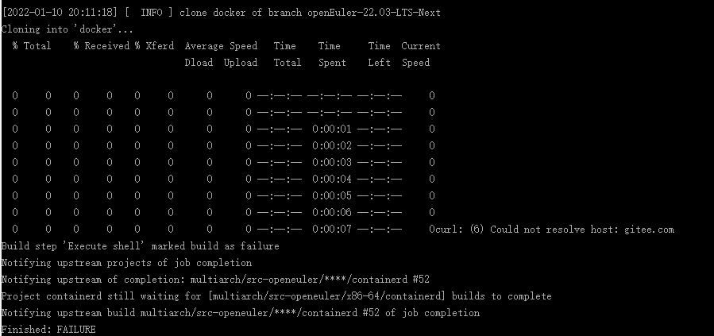

# 门禁问题排查手册

## 沟通地图
| 问题类型             | 接口人          | 其他责任人                                   |
|------------------|--------------|-----------------------------------------|
| 网络连接和jenkins连接异常 | 曹志 00567459  | 赵春江 wx109996、刘奇 wx945631                |
| obs缺依赖问题         | 夏森林 00444794 | 王冲 wx790418                             |
| 门禁检查异常           | 郑耀辉 00617286 | 李海炜 00464163、王欢 wx1101975、程少巍 wx1134741 |

## 一、网络问题

### - gitee连接失败

**报错信息：**Could not resolve host: gitee.com

**原因：**容器环境连接gitee失败。

**解决：**"/retest" 重试三次，若仍失败，请联系刘奇（liuqi145@huawei.com）

## 二、依赖问题

## 三、检查失败

## 四、测试用例失败

