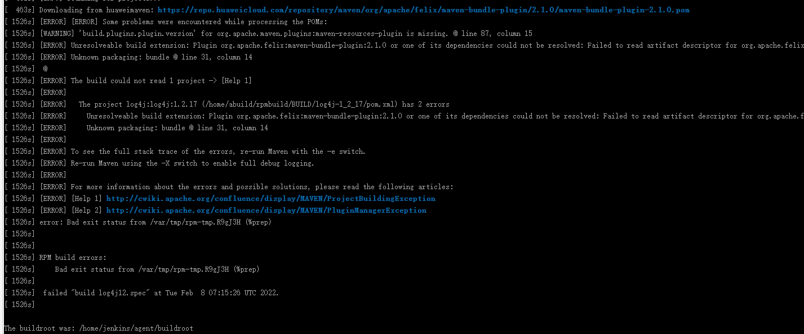
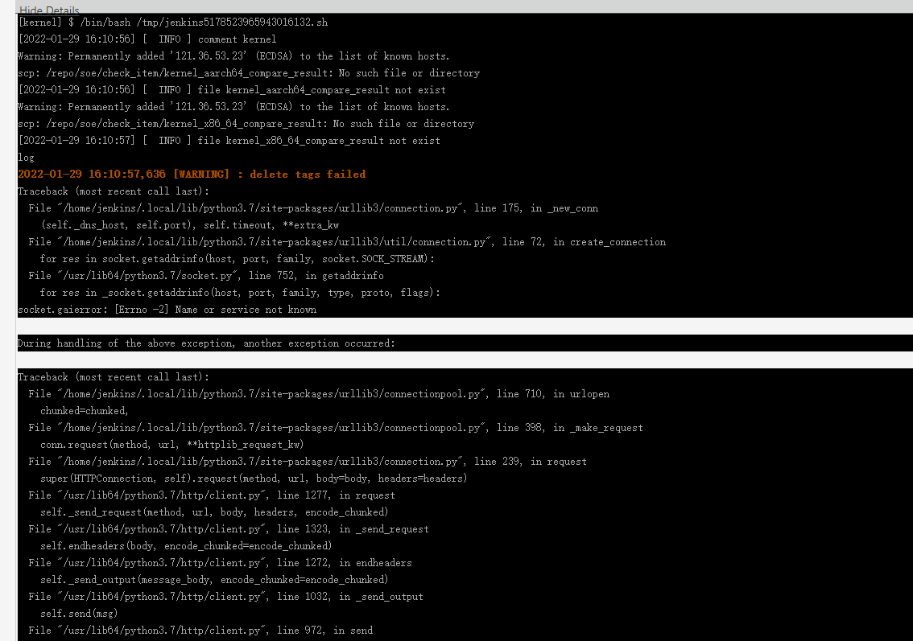
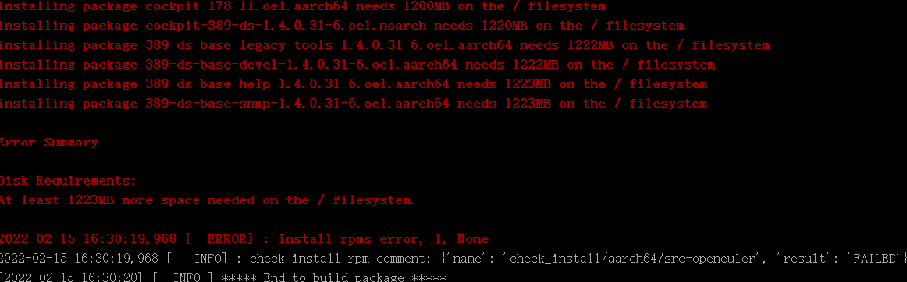

# 门禁问题排查手册

## 沟通地图
| 问题类型             | 接口人          | 其他责任人                                   |
|------------------|--------------|-----------------------------------------|
| 网络连接和jenkins连接异常 | 曹志 00567459  | 赵春江 wx109996、刘奇 wx945631                |
| obs缺依赖问题         | 夏森林 00444794 | 王冲 wx790418                             |
| 门禁检查异常           | 郑耀辉 00617286 | 李海炜 00464163、王欢 wx1101975、程少巍 wx1134741 |

## 一、网络问题

### - gitee连接失败

**报错信息：**Could not resolve host: gitee.com

**原因：**容器环境连接gitee失败。

**解决：**"/retest" 重试三次，若仍失败，请联系刘奇（liuqi145@huawei.com）

### - java包编译失败-maven连接失败

**报错信息：**[ERROR] Failed to execute goal on project xxx: Could not resolve dependencies for project xxx: Cannot access huaweimaven (https://repo.huaweicloud.com/repository/maven/)

**原因：**jenkins环境网络整改，禁用了ip（nginx动态分配）

**解决:** 联系赵春江 wx1092996放开ip限制

## 二、流程问题

### - 门禁未触发/门禁一直ci_processing/门禁结果不回显

**报错信息：**PR中没有门禁结果回显信息

后台comment任务报错：

**原因：**comment中使用jenkins地址（http://jenkins.jenkins）是内置的别名，解析别名失败。

**解决：**联系郑耀辉 00617286  ——不使用jenkins别名，直接使用jenkins域名https://openeulerjenkins.osinfra.cn/。

## 三、依赖问题

### - 缺少二进制包

**报错信息：**Error: Failed to retrieve plexus-archiver-3.6.0-3.oe1.noarch.rpm from the following locations (in order):

http://117.78.1.88/build/openEuler:selfbuild:BaseOS/mainline_standard_x86_64/x86_64/_repository/plexus-archiver

**原因：**缺少二进制包。

**解决：**请联系周夏香wx1132686添加。

### - 缺少依赖包

**报错信息：**WARNING: SSL certificate checks disabled. Connection is insecure! 

buildinfo is broken... it says: 

unresolvable: nothing provides llvm-devel = 12.0.1 

nothing provides llvm-static = 12.0.1 

nothing provides llvm-googletest = 12.0.1 

2022-02-16 15:40:07,269 [  ERROR] : build package error, 1 

2022-02-16 15:40:07,270 [  ERROR] : build standard_aarch64 ... failed 

2022-02-16 15:40:07,270 [  ERROR] : build openEuler:Mainline clang aarch64 ... failed

**问题：**该工程依赖pygments和llvm包，但是编译时在obs上没有找到对应版本的包。

**解决：**确保obs上面有编译好的对应版本的依赖包。

## 四、检查失败

### - 检查安装失败

**报错信息：**Error:

Problem: conflicting requests 

- nothing provides python3-cryptography needed by python3-SecretStorage-3.1.1-1.oe1.noarch 

- nothing provides python3-jeepney needed by python3-SecretStorage-3.1.1-1.oe1.noarch 

- nothing provides python3.9dist(cryptography) needed by python3-SecretStorage-3.1.1-1.oe1.noarch 

- nothing provides python3.9dist(jeepney) needed by python3-SecretStorage-3.1.1-1.oe1.noarch 

- nothing provides python(abi) = 3.9 needed by python3-SecretStorage-3.1.1-1.oe1.noarch

**问题：**由于该pr合入的分支没有找到对应的repo源，导致找不到依赖包。

**解决：**请检查是否存在该分支的repo，可以找王冲 wx790418确认，如果该repo确实存在，则联系门禁开发人员检查代码，请联系郑耀辉 00617286。

## 五、测试用例失败

## 六、代码问题

### - git fetch失败

**报错信息：**git fetch failed, 128

**原因：**该pr代码有冲突未解决。

**解决：**解决冲突后重试，重试后仍然失败请联系郑耀辉 00617286。

## 七、基础设施

### - 空间不足

**报错信息：**Disk Requirements:

At least 1223MB more space needed on the / filesystem.

**问题：**编译过程中空间不足报错。

**解决：**可能是jenkins多任务并行导致的，可以重试下，重试后仍然失败请联郑耀辉 00617286。

